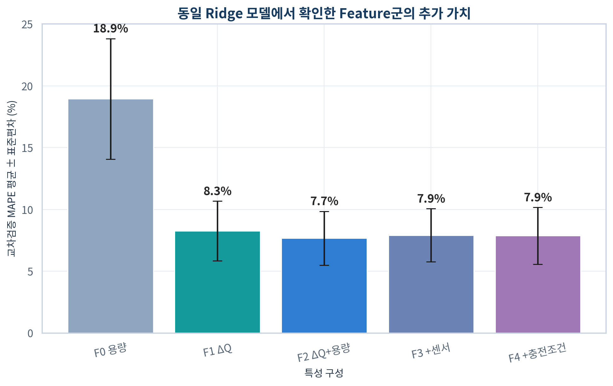
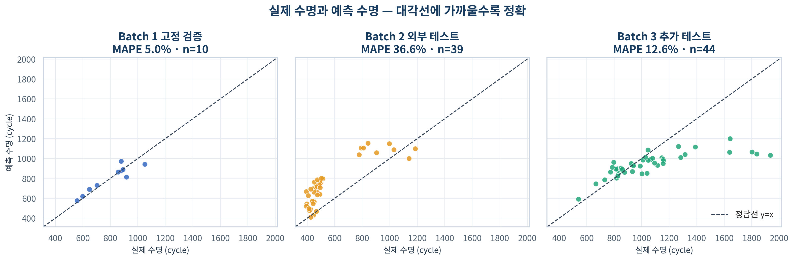

# ESS 배터리 수명 예측

배터리를 수명이 끝날 때까지 기다리지 않고 **초기 100 cycle 데이터만으로 Cycle Life를 예측**하는 프로젝트다. 초기 열화 신호를 이용해 수명이 짧을 가능성이 큰 Cell을 조기에 식별하고, ESS의 점검·정비·교체계획 수립에 활용할 수 있는지 검증한다.

Day 1에서는 배터리 수명 분포, 열화곡선, ΔQ(V), 충전조건과 초기 센서 신호를 탐색했다. Day 2에서는 이 결과를 실제 Feature Engineering에 반영하고, Batch 1에서 선택한 모델이 조건이 다른 Batch 2와 Batch 3에도 일반화되는지 평가했다.

> **최종 결론:** 초기 ΔQ(V)는 유효한 수명 신호였지만, Batch 간 분포 이동이 크면 내부 검증 성능만으로 외부 성능을 보장할 수 없었다. 현재 모델은 연구·점검 우선순위 보조에는 활용 가능하지만, drift 감지와 안전 보정 없이 실제 ESS에 바로 적용해서는 안 된다.

## 프로젝트 개요

- 데이터셋: MIT-Stanford Battery Dataset — Severson et al., *Nature Energy* (2019)
- 학습 데이터: Batch 1 (`2017-05-12`)
- 필수 평가 데이터: Batch 2 (`2018-02-20`)
- 추가 일반화 평가: Batch 3 (`2018-04-12`)
- 태스크: **Regression — Cycle Life 예측**
- 입력 범위: Cell별 초기 100 cycle 이내 측정값과 사전 충전조건
- Target: SOH 80% 도달 시점의 `cycle_life`
- 분석 단위: Cell당 1행
- 주 평가지표: MAPE (%)
- 보조 평가지표: MAE, RMSE, R², Median APE
- 최종 모델: `F2 ΔQ+Capacity + Ridge(alpha=1.0)`
- 최종 Feature: `delta_q_iqr`, `qd_mean`, `qd_slope`

### 데이터와 평가 역할

| 데이터 | Target 가용 Cell | 사용 목적 | Feature·모델 선택에 사용 |
|---|---:|---|---|
| Batch 1 development | 36 | 반복 교차검증과 후보 비교 | 사용 |
| Batch 1 fixed hold-out | 10 | 설정 동결 전 내부 점검 | 제한적으로 사용 |
| Batch 2 | 39 | 최종 외부 Batch 테스트 | 사용하지 않음 |
| Batch 3 | 44 | 추가 일반화 평가 | 사용하지 않음 |

Batch 2 결과를 확인한 뒤 Feature나 Hyperparameter를 다시 조정하지 않았다. 동일하게 동결된 모델로 Batch 3도 평가했다.

## 파일 구조

```text
├── data/
│   └── README.md                         # 원본 .mat 파일명과 배치 방법
├── guide/
│   ├── DAY1_과제_안내.md
│   └── DAY2_과제_안내.md
├── notebooks/
│   ├── 01_EDA.ipynb                     # Day 1 탐색적 데이터 분석
│   ├── 02_feature_engineering.ipynb     # 원본 추출, ΔQ, Feature Table, 품질·누수 검사
│   └── 03_modeling.ipynb                # CV, Ablation, 모델 선택, 외부 평가, 오류 분석
├── src/
│   ├── day1_analysis.py                 # Day 1 전체 분석 파이프라인
│   ├── day2_analysis.py                 # Day 2 전체 분석 파이프라인
│   ├── build_day2_notebooks.py          # 제출용 Day 2 노트북 생성
│   ├── render_day2_figures.py           # Day 2 그래프 재생성
│   └── validate_day2_outputs.py         # 산출물·누수·분할 자동검사
├── results/
│   ├── day1/                            # Day 1 통계표와 Feature 진단 결과
│   └── day2/                            # Feature Table, CV, 예측, 성능·오류표
├── figures/
│   ├── day1/                            # Day 1 한국어 그래프
│   └── day2/                            # Day 2 한국어 그래프
├── reports/
│   ├── DAY1_분석_보고서.md
│   ├── DAY2_분석_계획.md
│   └── DAY2_분석_보고서.md
├── requirements-day1.txt
├── requirements-day2.txt
└── README.md
```

원본 `.mat` 파일은 수 GB 크기이므로 Git 저장소에 포함하지 않는다. 필요한 파일과 정확한 배치 위치는 [`data/README.md`](data/README.md)를 참고한다.

## 환경 설정

### 1. 저장소와 가상환경 준비

```bash
git clone https://github.com/limeorange/ess-battery-health.git
cd ess-battery-health

python3 -m venv .venv
source .venv/bin/activate
python -m pip install --upgrade pip
pip install -r requirements-day2.txt
```

Windows에서는 가상환경을 다음과 같이 활성화한다.

```powershell
.venv\Scripts\activate
```

### 2. 원본 데이터 배치

다음 세 파일을 `data/` 아래에 둔다.

```text
data/
├── 2017-05-12_batchdata_updated_struct_errorcorrect.mat
├── 2018-02-20_batchdata_updated_struct_errorcorrect.mat
└── 2018-04-12_batchdata_updated_struct_errorcorrect.mat
```

### 3. 노트북 실행

```bash
jupyter lab
```

권장 실행 순서는 다음과 같다.

1. [`01_EDA.ipynb`](notebooks/01_EDA.ipynb)
2. [`02_feature_engineering.ipynb`](notebooks/02_feature_engineering.ipynb)
3. [`03_modeling.ipynb`](notebooks/03_modeling.ipynb)

두 Day 2 노트북에는 핵심 구현 코드가 직접 포함되어 있다. 빠른 검토를 위한 기본 설정은 다음과 같다.

```python
REBUILD_FROM_RAW = False
RUN_FULL_CV_SEARCH = False
```

원본 `.mat` 추출과 전체 Hyperparameter 탐색까지 다시 수행하려면 각각 `True`로 변경한다. 기본 설정에서도 최종 Ridge 모델 적합과 Batch 1 hold-out·Batch 2·Batch 3 예측은 노트북에서 실제로 다시 실행된다.

### 4. 명령행 전체 재현과 검증

```bash
python src/day2_analysis.py
python src/validate_day2_outputs.py
```

저장된 결과표에서 그래프만 다시 만들려면 다음을 실행한다.

```bash
python src/render_day2_figures.py
```

## EDA

### Cycle Life 분포

- 전체 관측 범위는 **392~1,935 cycle**이다.
- 중앙값은 Batch 1 **858.5**, Batch 2 **472.0**, Batch 3 **1,005.5 cycle**로 크게 다르다.
- Batch 2의 39개 Cell 중 28개, 즉 **71.8%가 500 cycle 미만 단수명**이다.
- Batch 3는 44개 중 23개, 즉 **52.3%가 1,000 cycle 초과 장수명**이다.
- 세 Batch의 분포 차이는 통계적으로도 컸다: Kruskal–Wallis `H=53.925`, `p=1.95×10⁻¹²`.
- Tukey 기준 특이 Cell은 12개였고 모두 상단 장수명 Cell이었다. 하단 이상치는 없었다.

**핵심 발견:** Batch 2의 짧은 수명은 몇 개의 불량 Cell이 만든 이상치가 아니라 Batch 전체에 형성된 저수명 군집이다. 따라서 Cell 몇 개를 제거하기보다 다른 Batch에서 모델이 버티는지 검증해야 한다.

### 열화 곡선 분석

- 초기 100 cycle의 평균 방전용량은 장수명과 단수명을 일관되게 구분하지 못했다.
- Knee 이후의 용량 감소 기울기는 Knee 이전보다 중앙값 기준 약 10배 이상 가팔랐다.
- Knee cycle과 최종 Cycle Life의 Spearman 상관은 `ρ=0.934`로 강했다.
- 그러나 Knee는 대부분 최종 수명의 약 75~79% 지점에 나타나므로 초기 100 cycle 시점에는 알 수 없다.

**핵심 발견:** 배터리 열화는 일정한 속도로 진행되지 않고 후반에 가속된다. Knee는 현상을 설명하는 데 유용하지만 미래정보이므로 예측 Feature에서는 제외해야 한다.

### ΔQ(V) 곡선 분석

ΔQ(V)는 동일 전압에서 cycle 100과 cycle 10의 누적 방전용량 차이다.

```text
ΔQ(V) = Qdlin(cycle 100, V) - Qdlin(cycle 10, V)
```

- 단수명 Cell은 세 Batch 모두에서 ΔQ(V)의 변화 폭이 큰 방향으로 나타났다.
- `delta_q_log10_var`와 Cycle Life의 Spearman 상관은 Batch 1 `-0.871`, Batch 2 `-0.709`, Batch 3 `-0.797`이었다.
- 수명 상·하위 25%의 ΔQ 순위 효과크기는 세 Batch 모두 `-1.0`이었다.
- 여러 ΔQ 파생값은 같은 곡선에서 계산되어 서로 강하게 중복됐다.

**핵심 발견:** 총 방전용량이 아직 비슷해 보이는 초기 구간에도 전압별 곡선에는 수명과 연결된 변화가 나타났다. 따라서 ΔQ를 Core Feature군으로 사용하되, 중복 파생값을 모두 넣지 않고 대표값 하나를 교차검증으로 선택한다.

### 충전 속도(C-rate)와 수명의 관계

- 1단계 C-rate와 Cycle Life의 관계는 Batch 1 `ρ=-0.483`, Batch 2 `ρ=+0.055`로 방향과 크기가 달랐다.
- 전체 데이터를 합친 상관도 `ρ=-0.027`로 매우 약했다.
- 반면 1단계 C-rate와 ΔQ 로그분산의 관계는 세 Batch에서 모두 양의 방향이었다.
- Batch 효과를 보정한 부분 순위상관은 `ρ=0.348`, 보정 `q=0.002`였다.

**핵심 발견:** “고속 충전이면 반드시 수명이 짧다”는 단일 규칙은 지지되지 않았다. 높은 C-rate와 큰 초기 ΔQ 변화가 함께 나타났지만, 현재 관찰자료만으로 충전 속도의 인과효과를 단정할 수 없다.

### 상관관계와 Feature 중복

- 초기 `qd_mean`과 수명의 Batch별 상관은 `0.242`, `0.117`, `0.162`로 약했다.
- `qd_slope`는 Batch별 관계 방향도 일정하지 않았다.
- 전체 데이터를 합친 상관은 Batch 평균 차이 때문에 과장될 수 있어 전체와 Batch별 결과를 함께 확인했다.
- ΔQ 분산·표준편차·IQR·면적 등은 사실상 같은 곡선 변화 크기를 반복 표현했다.

**핵심 발견:** 상관계수는 후보를 찾는 1차 근거일 뿐이다. 최종 Feature는 중복 제거, 동일 분할의 Ablation, 규제 모델과 외부 Batch 평가를 함께 사용해 선정해야 한다.

## Modeling

### 피처 엔지니어링 전략

Day 1의 발견을 다음과 같이 Day 2에 연결했다.

| 단계 | Feature 구성 | 검증 목적 | 반복 CV MAPE |
|---|---|---|---:|
| F0 | Capacity: `qd_mean`, `qd_slope` | 가장 단순한 기준선 | 18.95% |
| F1 | ΔQ: `delta_q_iqr` | ΔQ 단독 기여 확인 | 8.26% |
| F2 | ΔQ + Capacity | 서로 다른 초기 신호의 보완성 | **7.68%** |
| F3 | F2 + IR·온도·충전시간 | Sensor의 추가 가치 | 7.91% |
| F4 | F3 + C-rate·전환 SOC 등 | Charging의 추가 가치 | 7.87% |

ΔQ 후보는 `delta_q_log10_var`, `delta_q_iqr`, `delta_q_min`, `delta_q_abs_area`를 Batch 1 development의 동일한 반복 CV에서 비교했다. `delta_q_iqr`가 MAPE 8.26%로 가장 낮아 대표값으로 선택됐다.

최종 Feature의 의미는 다음과 같다.

- `delta_q_iqr`: cycle 10→100 사이 ΔQ 곡선 중앙 50%의 변화 폭
- `qd_mean`: cycle 2~100의 평균 방전용량
- `qd_slope`: cycle 2~100의 방전용량 변화 기울기

Knee, EOL, cycle 100 이후 값과 Target 파생값은 미래정보이므로 입력에서 제외했다.

### 모델 선택 및 근거

- 후보 모델: Median Baseline, Linear Regression, Ridge, ElasticNet, 제한된 Gradient Boosting
- 검증 방식: Batch 1 development에서 `RepeatedKFold(5 folds × 10 repeats)`
- 전처리: 결측 대체와 Scaling을 sklearn Pipeline 안에서 각 train fold에만 fit
- 최저 CV MAPE: F4 + ElasticNet, **7.56%**, Feature 11개
- 최종 모델: **F2 ΔQ+Capacity + Ridge(alpha=1.0)**, **7.68%**, Feature 3개
- 선택 이유: 최저 후보와 차이가 0.12%p에 불과하고 1-SE 범위 안이면서 Feature 수와 모델 복잡도가 훨씬 작았다.

즉, 가장 낮은 점수 한 번보다 작은 표본에서의 안정성, 설명 가능성, 재현성을 우선했다.



## 성능 결과

| 평가 구간 | n | MAPE | MAE | RMSE | R² |
|---|---:|---:|---:|---:|---:|
| Batch 1 development 반복 CV | 36 | **7.68% ± 2.18%** | 64.24 | 78.99 | 0.740 |
| Batch 1 fixed hold-out | 10 | **4.99%** | 41.93 | 58.38 | 0.853 |
| Batch 2 외부 테스트 | 39 | **36.56%** | 188.86 | 210.93 | 0.075 |
| Batch 3 추가 테스트 | 44 | **12.63%** | 162.76 | 265.17 | 0.270 |

### 성능 Gap

| Gap | 값 | 의미 |
|---|---:|---|
| Train–Valid | -2.69%p | Hold-out이 CV 평균보다 쉬운 표본 구성이었음 |
| Valid–Test | +31.57%p | Batch 2로 이동하면서 일반화 성능이 크게 저하됨 |
| Target–Test | +27.46%p | 원논문 참고치 9.1%와 Batch 2 결과의 차이 |
| Batch 2–Batch 3 | -23.93%p | Batch 3 MAPE가 Batch 2보다 낮음 |

원논문의 9.1%는 데이터 전처리, Feature, split 조건이 다르므로 직접적인 합격선이 아니라 참고치로만 사용했다.



## 오류 분석

### 가장 크게 틀린 Cell과 공통점

- 최악의 예측은 `Batch2_006`이었다.
- 실제 수명은 393 cycle이지만 667 cycle로 예측해 APE가 **69.82%**였다.
- Batch 2 평균 실제 수명은 565.7 cycle, 평균 예측은 741.4 cycle로 평균 **175.7 cycle 과대 예측**했다.
- Batch 2의 39개 중 35개, 즉 **89.7%가 과대 예측**이었다.
- 단수명 Cell 28개의 MAPE는 **39.48%**였고 이 중 26개를 과대 예측했다.

### 원인 가설

- Batch 2의 Target 분포가 Batch 1보다 짧은 수명 쪽으로 크게 이동했다.
- Batch 2 평균 `delta_q_iqr`는 Batch 1보다 `+0.99 SD`, `qd_mean`은 `+1.79 SD` 이동했다.
- Batch 2의 `qd_mean` 51.3%, `qd_slope` 43.6%가 Batch 1 관측 범위를 벗어났다.
- Batch 1에서 학습한 “초기 Capacity·ΔQ → 수명” 관계가 Batch 2에서 약해지거나 달라졌다.
- 실험 시기, Cell 구조와 충전정책이 함께 변했으므로 단일 원인으로 분리하기 어렵다.

### 개선 방향

- 여러 Batch와 Cell 구조를 포함한 학습 데이터 확장
- 학습 범위를 벗어난 입력을 탐지하는 out-of-distribution·drift 경보
- Batch-aware 모델, 계층모델 또는 domain adaptation 검토
- 과대 예측에 더 큰 비용을 주는 비대칭 손실 또는 보수적 수명 하한 예측
- ΔQ 전압 grid 정합, 결측·외삽 처리와 Feature 구현의 독립 검증
- 새로운 충전정책·온도 범위·Cell 구조별 별도 검증과 재학습 기준 수립

## ESS 도메인 해석

### 실제 BESS에서 활용 가능한 의사결정

- 초기 운전 데이터로 열화가 빠를 가능성이 있는 Cell의 점검 우선순위 설정
- 예방정비 시점과 Cell·Module 교체 후보 선별
- 예비품과 정비 인력 수요 계획
- 보증·품질관리 단계에서 비정상 열화 경로의 조기 탐지
- Fleet 또는 Rack 단위의 수명 위험 모니터링을 위한 보조 신호 제공

### 운영상 위험

- **수명 과대 예측:** 열화 Cell의 점검·교체가 늦어져 가동 신뢰성과 안전 여유가 감소할 수 있다.
- **수명 과소 예측:** 아직 사용 가능한 Cell을 조기에 교체해 비용과 예비품 수요가 증가할 수 있다.

Batch 2에서는 과대 예측이 지배적이므로 단순 평균오차 문제가 아니라 안전 측면에서 위험한 편향이다.

### 실 배포 전에 필요한 것

- 운영 데이터에서의 독립 외부검증
- 온도 구배, Cell 불균형, 가변 부하와 휴지 조건을 포함한 Feature
- 입력 drift 경보와 예측 불확실성 구간
- Cell 예측을 Module·Rack 수준으로 집계할 때의 불확실성 전파
- 과대 예측을 제한하는 안전 마진과 사람의 최종 판단 절차
- 운영 중 오차가 임계치를 넘었을 때 재학습하는 명시적 정책

## 한계

- Batch 1의 Target 가용 Cell은 46개로 작다.
- Day 1에서 Batch 2·3의 분포를 이미 관찰했으므로 완전한 blind test는 아니다.
- 실험실 Cell 데이터는 실제 ESS의 온도 구배, Cell 불균형과 가변 부하를 모두 대표하지 않는다.
- 충전정책별 표본이 작고 Batch·Cell 구조와 함께 변해 인과효과를 분리하기 어렵다.
- 초기 100 cycle이 필요하므로 신규 설비에는 예측 전 대기기간이 존재한다.
- MAPE는 같은 cycle 오차라도 단수명 Cell에 더 큰 비율을 부여하므로 MAE·RMSE와 함께 해석해야 한다.

## 주요 결과 파일

| 파일 | 내용 |
|---|---|
| [`results/day2/feature_table.csv`](results/day2/feature_table.csv) | Cell당 1행의 전체 Feature Table |
| [`results/day2/feature_manifest.csv`](results/day2/feature_manifest.csv) | Feature 출처·공식·단위·누수 점검 |
| [`results/day2/split_assignment.csv`](results/day2/split_assignment.csv) | 고정 development·hold-out·외부 평가 배정 |
| [`results/day2/ablation_results.csv`](results/day2/ablation_results.csv) | F0~F4 Feature Ablation |
| [`results/day2/model_comparison.csv`](results/day2/model_comparison.csv) | 전체 Feature군·모델 비교 |
| [`results/day2/model_performance.csv`](results/day2/model_performance.csv) | 최종 성능표 |
| [`results/day2/predictions.csv`](results/day2/predictions.csv) | Cell별 실제값·예측값·잔차 |
| [`results/day2/gap_analysis.csv`](results/day2/gap_analysis.csv) | 네 종류의 성능 Gap |
| [`reports/DAY1_분석_보고서.md`](reports/DAY1_분석_보고서.md) | Day 1 상세 EDA 보고서 |
| [`reports/DAY2_분석_보고서.md`](reports/DAY2_분석_보고서.md) | Day 2 모델링·오류 분석 보고서 |

## 참고문헌

- Severson, K. A. et al. (2019). Data-driven prediction of battery cycle life before capacity degradation. *Nature Energy*, 4, 383–391. [https://doi.org/10.1038/s41560-019-0356-8](https://doi.org/10.1038/s41560-019-0356-8)

## 팀 구성

| 담당자 | 역할 |
|---|---|
| U094 이수현 | EDA, Feature Engineering, 모델 개발, Batch 2·3 성능 평가, 오류·Batch shift 분석, 보고서 작성 |

