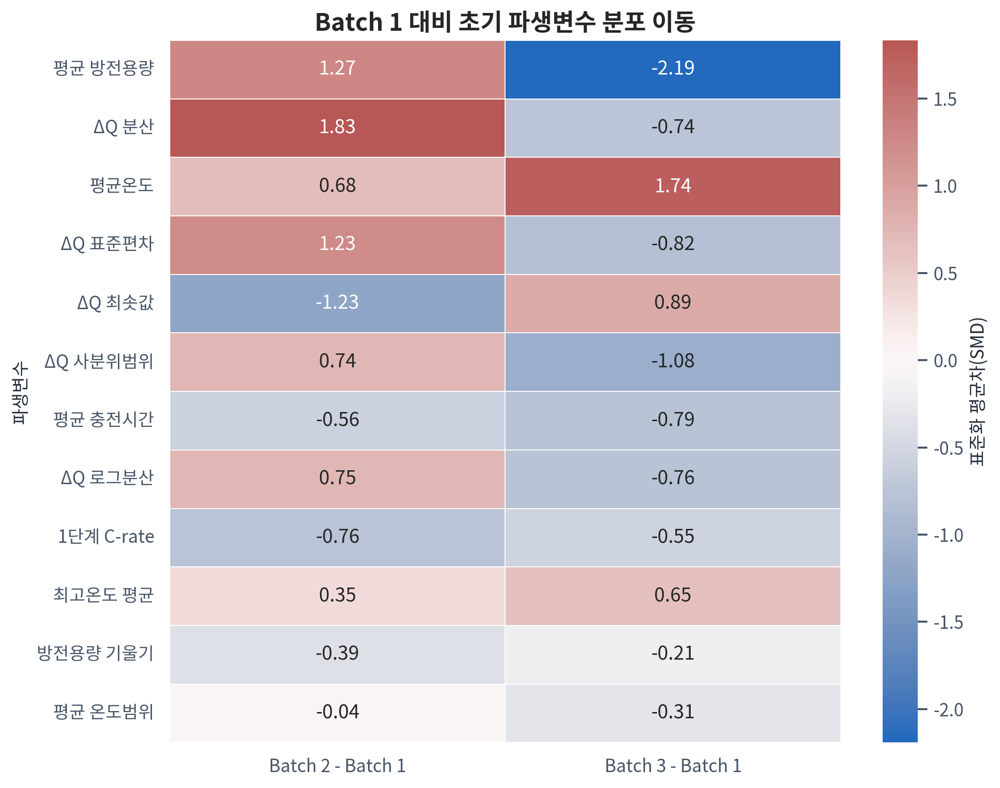

# Day 1 배터리 수명 예측 EDA 보고서

## 1. 분석 목적

초기 100사이클 데이터로 `cycle_life`를 예측하는 Day 2 Regression 모델을 설계하기 위해 Batch 1·2·3을 동일한 기준으로 분석했다. 원본 MATLAB v7.3 파일은 메모리에 일괄 적재하지 않고 HDF5 reference를 순차 접근했다. 모든 그래프는 한국어와 물리 단위를 표기했으며 사용 폰트는 `Noto Sans KR`이다.

## 2. 핵심 결론

- 원본 총 139개 셀을 품질 감사했고, target이 있는 129개 셀을 수명 분석에 사용했다: Batch 1 46개, Batch 2 39개, Batch 3 44개. `cycle_life`가 결측인 10개 셀은 target 기반 분석에서 제외했으며 기록 길이로 임의 대체하지 않았다.
- 배치별 수명 분포 차이에 대한 Kruskal-Wallis 검정은 H=53.925, p=1.95e-12였다. 이는 배치 간 분포 이동을 모델 일반화 위험으로 관리해야 함을 뜻한다.
- 전체 수명 곡선으로 계산한 knee point와 `cycle_life`의 Spearman ρ는 0.934였다. 다만 knee point는 미래 수명 정보를 사용하므로 Day 2 입력 feature에서는 제외한다.
- `ΔQ(V)` 로그 분산과 `cycle_life`의 Spearman ρ는 실제 학습 배치인 Batch 1에서 -0.871, 전체에서 -0.892였다. cycle 10·100만 사용하므로 Day 2 핵심 후보로 채택한다.
- 1단계 C-rate와 수명의 전체 Spearman ρ는 -0.027였다. 충전 정책별 표본이 작고 배치·구조가 혼재하므로 인과관계가 아닌 연관성으로 해석한다.
- Batch 2·3 label을 이용한 결과는 외부 분포 감사용이다. 실제 feature·모델 선택은 Batch 1 내부 CV와 hold-out을 중심으로 수행한다.

## 3. 데이터 품질 감사

| 배치 | 셀 수 | Target 보유 셀 | Target 결측 셀 | 첫 사이클 0 셀 | 초기 IR 미가용 셀 | 초기 Tmin 이상 셀 | ΔQ 가용률(%) | Target 보유 셀 중 knee 분석률(%) | 정책 파싱률(%) |
| --- | --- | --- | --- | --- | --- | --- | --- | --- | --- |
| Batch 1 | 46.0 | 46.0 | 0.0 | 46.0 | 0.0 | 0.0 | 100.0 | 100.0 | 100.0 |
| Batch 2 | 47.0 | 39.0 | 8.0 | 0.0 | 7.0 | 3.0 | 100.0 | 100.0 | 100.0 |
| Batch 3 | 46.0 | 44.0 | 2.0 | 0.0 | 0.0 | 0.0 | 100.0 | 100.0 | 100.0 |

### 관찰

Batch 1의 모든 셀은 첫 사이클의 summary 값이 0이므로 초기 통계는 실제 cycle 2~100의 물리적으로 유효한 값으로 계산했다. Batch 2에는 `cycle_life` 결측 셀과 초기 IR이 전부 0인 셀이 있으며 0은 실제 저항이 아닌 결측 표현으로 처리했다. Target 결측 셀은 기록 길이로 수명을 대체하지 않았고 target 기반 분석과 knee point 분석에서 제외했다.

### 모델링 영향

Day 2 pipeline은 0값을 정상 측정값으로 평균에 포함하지 않아야 한다. IR은 결측 flag와 train-only imputation을 사용하고, ΔQ(V) 미가용 여부도 별도 flag로 보존한다.

## 4. 질문 1 — Cycle Life 분포

| 배치 | 셀 수 | 평균 | 중앙값 | 표준편차 | 최솟값 | Q1 | Q3 | 최댓값 | 왜도 |
| --- | --- | --- | --- | --- | --- | --- | --- | --- | --- |
| Batch 1 | 46.0 | 844.7 | 858.5 | 184.6 | 534.0 | 703.2 | 914.2 | 1227.0 | 0.5 |
| Batch 2 | 39.0 | 565.7 | 472.0 | 222.2 | 392.0 | 439.5 | 508.5 | 1186.0 | 1.6 |
| Batch 3 | 44.0 | 1059.7 | 1005.5 | 313.9 | 541.0 | 828.0 | 1155.2 | 1935.0 | 1.3 |

### 관찰

배치별 중앙값·분산·상한이 다르며 Batch 3은 장수명 꼬리가 상대적으로 길다. Tukey 1.5 IQR 기준 이상치는 12개였으며 삭제하지 않고 별도 사례로 보존했다. 이상치 중 `newstructure` 정책 표기가 있는 셀은 12개였지만 구조 효과와 배치 효과가 겹치므로 이를 단독 원인으로 단정하지 않는다.

| 배치 | 셀 ID | 수명 | 충전 정책 | 방향 | 초기 평균온도(°C) | 초기 평균 충전시간 | 1단계 C-rate | ΔQ 로그분산 |
| --- | --- | --- | --- | --- | --- | --- | --- | --- |
| Batch 2 | Batch2_007 | 777.000 | 4.8C(80%)-4.8C-newstructure | 높음 | 33.770 | 10.036 | 4.800 | -4.231 |
| Batch 2 | Batch2_008 | 904.000 | 5.2C(58%)-4C-newstructure | 높음 | 33.599 | 10.040 | 5.200 | -4.102 |
| Batch 2 | Batch2_009 | 791.000 | 5.6C(26%)-4.5C-newstructure | 높음 | 32.351 | 10.040 | 5.600 | -4.344 |
| Batch 2 | Batch2_032 | 809.000 | 4.8C(80%)-4.8C-newstructure | 높음 | 32.169 | 10.041 | 4.800 | -4.131 |
| Batch 2 | Batch2_033 | 1140.000 | 5.2C(58%)-4C-newstructure | 높음 | 32.742 | 10.040 | 5.200 | -4.231 |
| Batch 2 | Batch2_034 | 1186.000 | 5.6C(26%)-4.5C-newstructure | 높음 | 35.668 | 10.040 | 5.600 | -4.448 |
| Batch 2 | Batch2_043 | 1029.000 | 4.8C(80%)-4.8C-newstructure | 높음 | 33.929 | 10.037 | 4.800 | -4.271 |
| Batch 2 | Batch2_044 | 841.000 | 5.2C(58%)-4C-newstructure | 높음 | 33.960 | 10.041 | 5.200 | -4.364 |
| Batch 2 | Batch2_045 | 997.000 | 5.6C(26%)-4.5C-newstructure | 높음 | 35.271 | 10.040 | 5.600 | -4.175 |
| Batch 3 | Batch3_007 | 1836.000 | 4.8C(80%)-4.8C-newstructure | 높음 | 32.797 | 11.041 | 4.800 | -4.488 |
| Batch 3 | Batch3_038 | 1935.000 | 5C(67%)-4C-newstructure | 높음 | 34.746 | 10.044 | 5.000 | -4.342 |
| Batch 3 | Batch3_045 | 1801.000 | 4.8C(80%)-4.8C-newstructure | 높음 | 32.726 | 11.039 | 4.800 | -4.520 |

### 원인 가설

충전 프로토콜, 셀 구조, 실험 시기와 측정 길이 차이가 함께 작용했을 가능성이 있다. 관찰 자료만으로 특정 요인의 인과효과를 단정하지 않는다.

### Day 2 영향

Batch 1만으로 선택한 모델은 Batch 2·3에서 target 및 feature shift를 겪을 수 있으므로 Batch 1 CV, 고정 hold-out, Batch 2 외부 테스트를 분리한다.

## 5. 질문 2 — 방전용량 열화와 knee point

| 배치 | 분석 셀 수 | 중앙 knee cycle | 수명 대비 중앙 위치 | knee 이후 기울기 배수 |
| --- | --- | --- | --- | --- |
| Batch 1 | 46.000 | 601.000 | 0.750 | 9.774 |
| Batch 2 | 39.000 | 342.000 | 0.747 | 11.471 |
| Batch 3 | 44.000 | 819.500 | 0.794 | 9.982 |

### 관찰

초기 cycle 2~10의 방전용량 중앙값을 셀별 기준 용량으로 두고 SOH를 계산했다. `cycle_life`가 있고 전체 수명의 80% 이상이 관측된 129개 셀에서 9-point rolling median과 2구간 선형회귀로 knee point를 계산했다. 이 중 총수명의 50% 이전이 최적 분할점으로 나온 셀은 3개로, 자동 탐지 결과의 민감도 사례로 별도 확인해야 한다.

### 원인 가설

초기 완만한 열화 뒤 용량 감소가 가속되는 패턴은 내부 열화 누적과 연관될 수 있으나, 본 분석만으로 전기화학적 인과기전을 확정할 수 없다.

### Day 2 영향 및 feature 결정

knee point와 전체 열화곡선은 현상을 설명하는 탐색적 지표로만 사용한다. 자동 분할점이 전기화학적 knee의 정답이라고 단정하지 않으며, 미래 사이클을 포함하므로 Day 2 예측 feature에서는 명시적으로 제외한다.

## 6. 질문 3 — ΔQ(V) 초기 신호

| 배치 | Mann-Whitney U | p-value | 순위양분 상관 |
| --- | --- | --- | --- |
| Batch 1 | 0.000 | 0.000 | -1.000 |
| Batch 2 | 0.000 | 0.000 | -1.000 |
| Batch 3 | 0.000 | 0.000 | -1.000 |

### 관찰

실제 summary cycle 번호로 cycle 10·100의 위치를 찾고, 공통 `Vdlin`에서 `Qdlin(100)-Qdlin(10)`을 계산했다. 배치 내 상·하위 수명 25%의 중앙곡선과 IQR을 비교해 고정 임계값 그룹이 비어 생기는 문제를 피했다.

### Day 2 영향 및 feature 결정

`delta_q_log10_var`, `delta_q_min`, 절대면적 등은 초기 100사이클 내에서 계산할 수 있다. 상관이 높은 ΔQ feature를 모두 넣기보다 Batch 1 CV에서 대표 feature를 선택하거나 규제를 적용한다.

## 7. 질문 4 — 충전 조건과 수명

| 범위 | n | Spearman ρ | BH 보정 p |
| --- | --- | --- | --- |
| 전체 | 129.000 | -0.027 | 0.812 |
| Batch 1 | 46.000 | -0.483 | 0.002 |
| Batch 2 | 39.000 | 0.055 | 0.816 |
| Batch 3 | 44.000 | -0.229 | 0.416 |

### 관찰

충전 정책 문자열에서 1단계 C-rate, 전환 SOC, 2단계 C-rate를 분리했다. 정책별 n과 bootstrap 95% CI를 함께 표시했으며 n=1~2인 정책의 평균은 인과효과가 아닌 탐색적 경향으로만 해석한다.

### Day 2 영향 및 feature 결정

원문 정책 one-hot은 미지 정책에서 취약할 수 있다. 연속형 C-rate·전환 SOC feature를 우선 사용하고, 범주형 정책은 `handle_unknown='ignore'`가 적용된 보조 feature로 검토한다.

## 8. 질문 5 — 초기 신호와 수명

| Feature | Batch 1 ρ | Batch 2 ρ | Batch 3 ρ | 전체 ρ |
| --- | --- | --- | --- | --- |
| ΔQ 사분위범위 | -0.879 | -0.810 | -0.800 | -0.899 |
| ΔQ 표준편차 | -0.871 | -0.709 | -0.797 | -0.892 |
| ΔQ 분산 | -0.871 | -0.709 | -0.797 | -0.892 |
| ΔQ 로그분산 | -0.871 | -0.709 | -0.797 | -0.892 |
| ΔQ 5% 분위수 | 0.856 | 0.672 | 0.774 | 0.884 |
| ΔQ 최솟값 | 0.850 | 0.661 | 0.776 | 0.883 |
| ΔQ 25% 분위수 | 0.845 | 0.729 | 0.771 | 0.882 |
| ΔQ 제곱평균제곱근 | -0.843 | -0.697 | -0.765 | -0.878 |
| ΔQ 부호면적 | 0.828 | 0.697 | 0.756 | 0.869 |
| ΔQ 절대면적 | -0.828 | -0.697 | -0.758 | -0.870 |

### 관찰

Pearson과 Spearman을 함께 계산하고, 다중 검정은 Benjamini-Hochberg 방식으로 보정했다. 온도 계열과 ΔQ 계열처럼 서로 강하게 연관된 feature 군은 대표 변수를 선택하거나 Ridge/ElasticNet 규제를 사용해야 한다.

### 모델링 영향

배치 전체 상관은 배치 간 평균 차이에 의해 부풀려질 수 있다. 따라서 전체 상관과 배치별 상관의 방향·크기를 함께 보고, Day 2의 실제 선택은 Batch 1 CV 안정성을 우선한다.

## 9. 최종 feature 채택표

| Feature | 원본 | 사이클 범위 | 계산식 | Batch 1 ρ | Batch 2 ρ | Batch 3 ρ | 배치 방향성 | 가용률(%) | 결정 | 근거 | 누수 위험 |
| --- | --- | --- | --- | --- | --- | --- | --- | --- | --- | --- | --- |
| delta_q_log10_var | Qdlin | 10, 100 | log10(var(Q100-Q10)+1e-12) | -0.871 | -0.709 | -0.797 | 동일 방향 | 100.000 | 우선 채택 | 초기 열화 형상을 압축하며 원논문 핵심 계열 feature | 낮음: 100사이클 이내 |
| delta_q_min | Qdlin | 10, 100 | min(Q100-Q10) | 0.850 | 0.661 | 0.776 | 동일 방향 | 100.000 | 후보 채택 | 곡선의 국소 열화 강도 반영 | 낮음 |
| qd_slope | summary.QDischarge | 2~100 | QD~cycle 선형회귀 기울기 | 0.479 | -0.271 | 0.088 | 방향 불일치 | 100.000 | 조건부 후보 | 초기 용량 변화 속도를 반영하지만 배치별 상관 방향이 달라 CV·ablation 필요 | 낮음 |
| ir_slope | summary.IR | 2~100 | IR~cycle 선형회귀 기울기 | -0.323 | 0.211 | -0.203 | 방향 불일치 | 94.964 | 조건부 후보 | 저항 증가율 후보이나 Batch 2 결측과 배치별 방향 불일치 확인 필요 | 낮음 |
| tavg_mean | summary.Tavg | 2~100 | 초기 평균 온도 | -0.371 | 0.166 | 0.025 | 방향 불일치 | 100.000 | 조건부 후보 | 열 스트레스 후보이나 배치별 상관 방향이 달라 Batch 1 CV에서 검증 | 낮음 |
| tmax_mean | summary.Tmax | 2~100 | 초기 최고온도의 평균 | -0.323 | -0.136 | -0.035 | 동일 방향 | 99.281 | 조건부/중복 검토 | Tavg와 강한 공선성 가능; CV에서 한 변수만 선택 검토 | 낮음 |
| chargetime_mean | summary.chargetime | 2~100 | 초기 평균 충전 시간 | 0.619 | -0.756 | 0.192 | 방향 불일치 | 100.000 | 조건부 후보 | C-rate의 연속형 대리 변수이나 배치별 관계 반전이 커 민감도 분석 필요 | 낮음 |
| c_rate_stage1 / switch_soc_pct / c_rate_stage2 | policy_readable | 실험 설정 | 충전 정책 문자열 정규식 파싱 | -0.483 | 0.055 | -0.229 | 방향 불일치 | 100.000 | 조건부 후보 | 미지 정책 일반화에 유리하나 배치·셀구조 교란과 방향 불일치가 큼 | 낮음; 운영 시 사전 가용성 확인 |
| knee_cycle | 전체 QD 곡선 | 전체 수명 | 2구간 회귀 SSE 최소점 |  |  |  | 해당 없음 |  | Day 2 입력에서 제외 | 설명용으로 유용하지만 미래 전체 수명 정보 사용 | 매우 높음 |
| cycle_life / EOL 파생값 | target | 전체 수명 | target 또는 target 파생 |  |  |  | 해당 없음 | 100.000 | 제외 | 정답 누수 | 매우 높음 |

## 10. Day 2 모델 전략

1. **분석 단위:** 배터리 셀 1개당 feature 행 1개.
2. **학습·검증:** Batch 1을 fixed hold-out으로 먼저 분리하고 나머지에서 K-fold CV.
3. **외부 테스트:** 모든 선택 종료 후 Batch 2를 한 번 평가. Batch 3은 선택적 추가 테스트.
4. **Baseline:** Batch 1 train 중앙값 예측.
5. **선형 후보:** Ridge/ElasticNet — 작은 표본, 공선성 대응.
6. **비선형 후보:** Gradient Boosting/Random Forest — ΔQ, 온도, 충전조건의 비선형 상호작용 대응.
7. **선택 기준:** Batch 1 CV 평균 MAPE, fold 편차, hold-out Gap, 설명 가능성.
8. **전처리:** imputer·scaler·encoder를 모델과 하나의 sklearn Pipeline으로 구성하고 각 CV train fold에서만 fit.

## 11. 한계

- 배치별 셀 수가 작고 충전 정책별 표본은 더 작아 정책 효과의 인과 추론이 어렵다.
- Batch 2의 8개 셀과 Batch 3의 2개 셀은 `cycle_life`가 결측이므로 수명 분포·상관·knee 분석에서 제외했다. 이들이 중도절단된 장수명 셀이라면 관측된 target 분포에 편향이 남을 수 있다.
- 실험실 셀 데이터는 실제 ESS module/rack의 온도 구배, 셀 불균형, 운영 부하를 완전히 대표하지 않는다.
- Batch 2·3 label은 과제상 분포 설명에 사용했으나 Day 2 모델 튜닝에는 사용하지 않아야 한다.

## 12. 생성 산출물

- 재현 코드: `src/day1_analysis.py`
- 실행 노트북: `notebooks/01_EDA.ipynb`
- 수치 결과: `results/day1/*.csv`
- 한국어 그래프: `figures/day1/*.png`
- 본 보고서: `reports/DAY1_분석_보고서.md`
