# 초기 100 Cycle 기반 배터리 수명 예측
## Day 1 — 어떤 초기 신호가 배터리의 미래 수명을 설명하는가?

| 항목 | 내용 |
|---|---|
| 작성자 | U094 이수현 |
| 작성일 | 2026-10-01 (목) |
| 설명 보강 | 2026-10-02 (금) |
| 분석 단위 | Battery Cell 1개 = 독립 Sample 1개 |
| 예측 목표 | 초기 100 cycle 정보로 총 Cycle Life 예측 |
| Day 2 과제 | Regression — 배터리 수명 예측 |

---

## 0. Executive Summary

### 먼저 읽는 결론

이 프로젝트의 목적은 배터리를 수명 종료까지 시험하지 않고 **초기 100 cycle만으로 최종 Cycle Life를 예측**하는 것이다. 원본 139개 Cell을 품질 점검했고, 수명 정답이 있는 129개 Cell을 중심으로 다섯 가지 질문을 검토했다.

분석에서 가장 중요한 결론은 다음 세 가지다.

1. **Batch마다 수명 분포가 크게 다르다.** 관측된 Cycle Life는 392~1,935 cycle이며, 중앙값은 Batch 1 858.5, Batch 2 472.0, Batch 3 1,005.5 cycle이다. 따라서 한 Batch 안의 성능만으로 다른 Batch에서의 일반화를 보장할 수 없다.
2. **초기 방전용량 자체보다 ΔQ(V)가 더 일관된 수명 신호다.** 초기 QD 평균과 수명의 Batch별 상관은 약했지만, cycle 10과 100 사이 전압별 방전곡선 변화인 ΔQ(V)의 로그분산은 세 Batch에서 모두 강한 음의 상관을 보였다(ρ=-0.871, -0.709, -0.797).
3. **충전 속도 하나만으로 짧은 수명을 설명할 수 없다.** 1단계 C-rate와 수명의 관계는 Batch마다 달랐다. 다만 높은 1단계 C-rate는 ΔQ 변화가 큰 방향과 연결되어, 충전 조건이 초기 열화 경로에 관여할 가능성은 남았다. 이는 인과효과가 아니라 추가 검증이 필요한 연관성이다.

> **Day 2의 핵심 결정**  
> 연속형 Cycle Life를 예측하는 **Regression**을 수행한다. ΔQ(V)를 Core Feature군으로 두고, Capacity·Sensor·Charging Feature를 단계적으로 추가한다. Feature 선정은 높은 상관계수를 나열하는 방식이 아니라 **Batch 1 내부 검증, 중복 제거, 규제 모델, 동일 데이터 분할의 Ablation**으로 객관화한다.

### 이 보고서의 이야기를 여섯 문장으로 읽으면

배터리의 최종 수명을 100 cycle 시점에 미리 알고 싶다. 그런데 세 Batch는 애초에 수명 분포가 서로 달라, 같은 조건의 데이터라고 보기 어렵다. 눈에 보이는 QD 감소는 주로 수명 후반에 나타나기 때문에 초기 QD만으로는 미래를 충분히 설명하지 못했다. 대신 아직 총용량이 비슷해 보일 때도 전압별 방전곡선의 미세한 변화인 ΔQ(V)는 장수명과 단수명을 일찍 구분했다. 충전 조건도 이 변화와 연결되어 있었지만, 정책·Cell 구조·Batch 차이가 함께 얽혀 있어 충전 속도 하나를 원인이라고 말할 수는 없었다. 그래서 Day 2에서는 **ΔQ를 중심으로 가장 단순한 모델부터 시작하고, 다른 정보가 실제 예측오차를 줄일 때만 추가**한다.

이 흐름에서 각 EDA 질문은 독립된 그림 설명이 아니다. Q1은 **예측해야 할 데이터의 난이도**, Q2는 **미래정보와 초기정보의 경계**, Q3은 **가장 유망한 초기 신호**, Q4는 **충전 조건의 추가 역할**, Q5는 **과적합 없이 Feature를 고르는 기준**을 차례로 만든다.

### 이 보고서에서 주장하는 것과 주장하지 않는 것

- 이 보고서는 초기 신호와 Cycle Life 사이의 **통계적 연관성**을 설명한다.
- 관찰 데이터만으로 “특정 충전 정책이 열화를 일으켰다”는 **인과관계**를 주장하지 않는다.
- Knee point처럼 전체 수명을 관찰해야 알 수 있는 값은 열화 현상을 설명하는 데만 쓰고 예측 Feature에서는 제외한다.
- Batch 2·3의 정답은 Day 1의 분포와 안정성 진단에 이미 사용했다. 따라서 Day 2에서는 이 정답을 보고 Feature나 모델 설정값(Hyperparameter)을 다시 고르지 않으며, 결과를 완전한 Blind Test보다 **외부 Batch 검증**으로 해석한다.

---

## 1. 문제 정의 — 왜 초기 수명 예측이 필요한가?

### 1.1 해결하려는 문제

배터리의 실제 수명을 알려면 수백에서 수천 번 충·방전을 반복해 수명 종료 시점까지 기다려야 한다. **Cycle**은 충전과 방전을 한 번 수행한 단위이며, **Cycle Life**는 배터리가 처음 사용된 시점부터 **SOH(State of Health, 초기 설계용량 대비 현재 건강도) 80%**에 해당하는 EOL(End of Life, 수명 종료)까지 버틴 총 cycle 수다.

이번 프로젝트는 전체 열화 과정을 기다리지 않고, 관측 초반인 **100 cycle 이내의 정보**로 총 Cycle Life를 예측한다. ESS(Energy Storage System)는 전력을 저장했다가 필요할 때 공급하는 대규모 배터리 시스템이다. 수명을 미리 예측할 수 있으면 ESS 배터리의 점검·교체 시점을 더 일찍 계획하고, 갑작스러운 성능 저하 위험과 장기간 수명시험의 시간·비용을 줄일 수 있다.

### 1.2 Input과 Target

**Input — 초기 100 cycle**

- **QD(방전용량):** 한 번 방전할 때 실제로 꺼낼 수 있는 전하량
- **Q(V):** 전압이 변할 때 방전 가능한 용량을 나타내는 곡선
- **IR(내부저항):** 배터리 내부에서 전류 흐름을 방해하는 정도
- **온도:** cycle 중 평균·최고·최저 온도
- **충전시간:** 한 cycle의 충전에 걸린 시간
- **Charging Policy:** 충전 속도와 속도 전환 시점을 정한 실험 조건

↓

**Regression Model — 여러 초기 신호로 연속적인 수명 숫자를 예측**

↓

**Target — `cycle_life`**

`cycle_life`는 “100 cycle 이후 남은 수명”이 아니라 **처음부터 EOL까지의 총 cycle 수**다. Day 2에서 한 행, 즉 하나의 독립 학습 Sample은 cycle 하나가 아니라 **Battery Cell 하나**다.

### 처음 읽는 독자를 위한 핵심 용어

| 용어 | 이 보고서에서의 뜻 | 쉽게 말하면 |
|---|---|---|
| Cell | 개별 배터리 한 개 | 사람 한 명에 해당하는 분석 대상 |
| Batch | 비슷한 시기·조건에서 실험한 Cell 묶음 | 서로 다른 반·집단 |
| Cycle | 충전과 방전을 한 번 수행한 단위 | 배터리를 한 번 쓰고 다시 충전한 기록 |
| QD | 방전할 때 꺼낼 수 있는 용량 | 배터리가 실제로 내어줄 수 있는 에너지의 크기 |
| SOH | 초기 상태 대비 현재 건강도 | 새 배터리를 100점으로 봤을 때 남은 건강 수준 |
| SOC | 현재 저장된 전하의 비율 | 지금 얼마나 충전돼 있는지를 나타내는 잔량 표시 |
| IR | Cell 내부의 전기적 저항 | 전류 흐름을 방해하며 발열·전압강하와 관련된 신호 |
| C-rate | 정격용량 대비 충·방전 전류의 크기 | 값이 클수록 짧은 시간에 더 강하게 충전하는 조건 |
| EOL | 정해 둔 수명 종료 기준 | 더 이상 목표 성능을 만족하지 않는 시점 |
| Target | 모델이 맞혀야 하는 정답 | 이 프로젝트에서는 총 Cycle Life |
| Feature | 예측에 사용하는 입력 정보 | 초기 QD, 온도, ΔQ 등 수명을 추정하는 단서 |
| ΔQ(V) | cycle 10과 100의 전압별 방전곡선 차이 | 총용량이 크게 줄기 전 나타나는 ‘열화 지문’ |
| Correlation | 두 값이 함께 움직이는 정도 | 함께 변한다는 뜻이지, 하나가 다른 하나의 원인이라는 뜻은 아님 |
| Data Leakage | 예측 시점에 알 수 없는 미래정보 사용 | 시험 전에 정답지를 일부 보고 푸는 것과 같음 |

배터리 데이터의 구조는 **Cell → 그 Cell의 여러 Cycle → 각 Cycle 안의 센서 측정값** 순서다. 센서 기록은 매우 많아 보여도 같은 Cell에서 반복 측정된 값은 서로 독립적인 사람이 여러 명 늘어난 것과 같지 않다. 따라서 모델의 실질적인 표본 수는 측정 행 수가 아니라 Cell 수이며, 이 점이 복잡한 모델을 피해야 하는 가장 중요한 이유 중 하나다.

### 1.3 Day 1의 다섯 질문

1. **Cycle Life 분포는 어떻게 생겼는가?** 범위·단수명/장수명 비율·특이 Cell을 확인한다.
2. **방전용량은 어떻게 감소하는가?** 열화가 일정한지, 급격해지는 knee가 있는지 확인한다.
3. **초기 ΔQ(V)에서 수명 차이가 보이는가?** 곡선 차이를 수치 Feature로 바꾼다.
4. **충전 조건은 수명 및 초기 열화와 어떤 관계인가?** 단순한 고속 충전 가설이 반복되는지 본다.
5. **어떤 Feature를 남길 것인가?** Target 관계, Batch 안정성, Feature 중복성을 함께 평가한다.

---

## 2. 데이터와 분석 원칙 — 무엇을, 어떤 기준으로 비교했는가?

### 2.1 Dataset

| Dataset | 전체 Cell | Target 보유 Cell | Target 결측 Cell | Day 2 역할 |
|---|---:|---:|---:|---|
| Batch 1 | 46 | 46 | 0 | 모델 개발·내부 검증 |
| Batch 2 | 47 | 39 | 8 | 외부 Batch 검증 |
| Batch 3 | 46 | 44 | 2 | 추가 분포 이동 확인 |
| **합계** | **139** | **129** | **10** |  |

Batch는 서로 다른 시기와 실험 조건에서 수집된 Cell 묶음이다. 반복 기록은 EDA에서 열화곡선으로 펼쳐 보지만, 모델 입력은 초기 100 cycle을 요약해 **Cell당 한 행**으로 만든다. 기록된 cycle 수가 많아도 독립 표본은 Cell 수이므로 Batch 1의 학습 표본은 46개뿐이다.

서로 다른 Batch에서 Feature나 Target의 범위·비율·관계가 달라지는 현상을 **분포 이동(distribution shift)**이라고 한다. 이는 시험공부를 한 교재와 실제 시험의 문제 유형이 다른 상황과 비슷하다. Batch 1에서 배운 규칙이 Batch 2에 그대로 적용되지 않을 수 있으므로, 분포 이동은 단순한 데이터 설명이 아니라 외부 성능을 좌우하는 핵심 위험이다.

### 2.2 데이터 품질 점검

- Batch 1의 모든 Cell은 첫 summary cycle에 실측값이 아닌 0 채움값(placeholder)이 있어 초기 통계는 cycle 2부터 계산했다.
- Batch 2의 8개 Cell과 Batch 3의 2개 Cell은 `cycle_life`가 결측이다.
- Batch 2의 7개 Cell은 초기 IR이 미가용이고, 3개 Cell은 초기 Tmin에 비정상 값이 있다.
- 첫 cycle placeholder와 일부 물리 범위 밖 QD 값은 초기 Feature 계산에서 제외했다.
- 결측 `cycle_life`를 관측된 기록 길이로 임의 대체하지 않았다.
- 이상값이라는 이유만으로 원본 Cell을 임의 삭제하지 않았다.

이 점검이 중요한 이유는 전처리 오류가 강한 가짜 패턴을 만들 수 있기 때문이다. 예를 들어 첫 cycle의 0을 실제 측정값으로 취급하면 초기 용량이 갑자기 증가한 것처럼 보이고, 수명 정답이 없는 Cell에 현재 기록 길이를 넣으면 아직 시험이 끝나지 않은 Cell을 단수명으로 오인할 수 있다. 따라서 “데이터가 비어 있거나 이상해 보인다”는 이유만으로 값을 채우지 않고, **측정 오류·미관측·실제 극단값을 구분**했다.

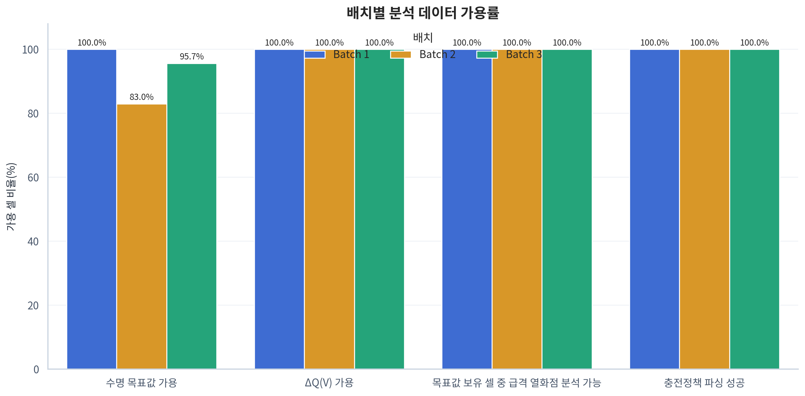

*Figure 1. Batch별 Target 및 초기 신호 가용률. 결측 여부는 해당 Feature를 사용할 때의 표본 수와 전처리 전략에 직접 반영했다.*

### 2.3 통계 해석 원칙

- 연속형 변수 관계는 이상값과 비선형 단조 관계에 비교적 강한 **Spearman ρ**를 중심으로 해석했다.
- 전체 데이터의 상관은 Batch 평균 차이로 커질 수 있으므로 **전체와 Batch별 결과를 함께** 확인했다.
- 보강 분석의 여러 검정은 **Benjamini–Hochberg 보정 p값(q값)**을 함께 계산했다.
- p값은 “효과가 크다”는 뜻이 아니므로 **효과크기, 중앙값, 표본 수**를 함께 제시했다.
- 관찰 자료의 상관은 원인과 결과를 증명하지 않는다. 정책·Cell 구조·실험 시기가 동시에 달라진 경우에는 특히 인과 표현을 피했다.

여러 Feature를 동시에 검사하면 우연히 작게 나온 p값이 하나쯤 생길 가능성이 커진다. Benjamini–Hochberg 보정은 이 **다중검정 문제**를 완화해, 발견했다고 표시한 결과 중 우연한 양성의 비율이 과도하게 커지지 않도록 한다. 보고서의 q값은 이 보정 이후의 값이다.

#### 보고서의 숫자를 읽는 최소 기준

| 표기 | 읽는 방법 | 주의할 점 |
|---|---|---|
| `ρ=+1`에 가까움 | 한 값이 커질 때 다른 값도 거의 항상 커짐 | 원인이라는 뜻은 아님 |
| `ρ=-1`에 가까움 | 한 값이 커질 때 다른 값은 거의 항상 작아짐 | 음수는 ‘나쁨’이 아니라 반대 방향이라는 뜻 |
| `ρ≈0` | 일관된 순위 관계가 거의 없음 | 곡선형 관계까지 없다는 뜻은 아님 |
| p값·q값이 작음 | 우연한 표본 변동만으로 보기 어려움 | 차이의 크기나 실무적 중요성을 보장하지 않음 |
| 중앙값 | 값을 순서대로 놓았을 때 가운데 값 | 극단적으로 크거나 작은 값의 영향을 평균보다 덜 받음 |
| 95% 신뢰구간 | 추정값의 불확실성을 보여주는 범위 | 구간이 넓으면 표본이 적거나 변동이 크다는 신호 |

이 보고서에서는 통상적인 절대 기준으로 ρ 약 0.1은 약한 관계, 0.3은 중간 정도, 0.5 이상은 강한 관계로 참고한다. 다만 표본 수와 데이터 구조에 따라 의미가 달라질 수 있으므로, 숫자 하나보다 **Batch마다 방향이 반복되는지**를 더 중요하게 본다.

---

## 3. EDA — 다섯 질문으로 초기 수명 신호를 좁히기

### 3.1 Q1. Cycle Life 분포는 어떻게 생겼는가?

#### 질문

모델이 맞혀야 할 수명 범위는 얼마이며, 단수명·장수명 비율과 특이 Cell은 Batch마다 같은가?

> **한 문장 답**  
> 같지 않다. 특히 Batch 2는 몇 개의 Cell만 짧은 것이 아니라 **집단 전체가 짧은 수명 쪽으로 이동**해 있어, 모델이 학습하지 못한 환경 차이를 만날 가능성이 크다.

#### 근거

수명 분포 그림은 과제 기준에 맞춰 150~2,300 cycle 축으로 표시했다. 실제 관측 범위는 **392~1,935 cycle**이다. Histogram의 막대가 높은 구간은 그 수명대의 Cell이 많다는 뜻이다. 누적분포는 왼쪽으로 갈수록 짧은 수명의 Cell이 얼마나 빨리 쌓이는지를 보여준다. 따라서 두 그래프를 함께 보면 단순히 평균만 다른지, 아니면 집단의 전체 모양과 범위가 다른지 구분할 수 있다.

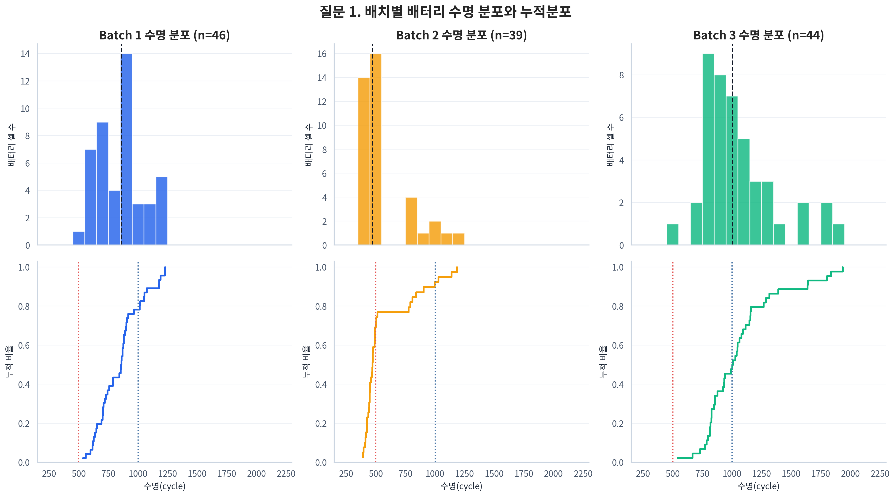

*Figure 2. Batch별 Cycle Life histogram과 누적분포. Batch 2는 왼쪽, Batch 3은 오른쪽으로 이동해 있다.*

| Batch | Target 수 | 최소 | 중앙값 | 최대 | 단수명 `<500` | 중간 `500~1,000` | 장수명 `>1,000` |
|---|---:|---:|---:|---:|---:|---:|---:|
| Batch 1 | 46 | 534 | **858.5** | 1,227 | **0.0%** | 78.3% | 21.7% |
| Batch 2 | 39 | 392 | **472.0** | 1,186 | **71.8%** | 20.5% | 7.7% |
| Batch 3 | 44 | 541 | **1,005.5** | 1,935 | **0.0%** | 47.7% | 52.3% |

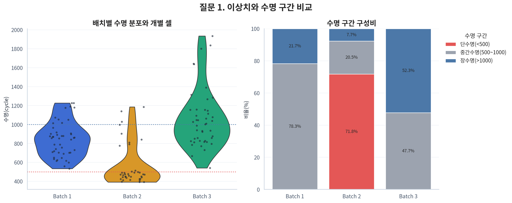

*Figure 3. 수명 분포와 구간 비율. Batch 2의 500 cycle 미만 Cell은 소수의 예외가 아니라 39개 중 28개인 주된 군집이다.*

세 Batch의 순위 분포 차이는 통계적으로도 컸다(Kruskal–Wallis H=53.925, p=1.95×10⁻¹²). 다만 이 검정은 “적어도 하나의 분포가 다르다”는 근거이며, 무엇이 차이를 만들었는지는 알려주지 않는다.

#### 이상치와 저수명 Cell은 같은 문제인가?

여기서 **이상치(outlier)**는 “고장 난 Cell”이라는 판정이 아니다. 같은 Batch 안의 대부분과 비교했을 때 유난히 멀리 떨어진 값을 통계 규칙으로 표시한 것이다. Tukey 방법은 가운데 50%가 차지하는 범위를 기준으로 정상적인 변동 폭을 정하고, 그 범위를 크게 벗어난 Cell을 확인한다.

이 규칙으로 확인한 특이 Cell은 **12개이며 모두 상단, 즉 같은 Batch의 대부분보다 훨씬 오래 산 Cell**이었다. Batch 2의 9개와 Batch 3의 3개 모두 정책명에 `newstructure`가 포함됐다. 대표적으로 Batch2_033은 1,140 cycle, Batch2_034는 1,186 cycle, Batch3_038은 1,935 cycle이었다. 이 결과는 `newstructure`가 긴 수명과 함께 나타났다는 관찰 근거지만, 구조 변경이 수명을 늘렸다고 단정하는 실험적 증거는 아니다.

반대로 **하단 Tukey 이상치는 한 개도 없었다.** 이 문장이 뜻하는 바는 “짧은 수명의 Cell이 없다”가 아니다. 실제로 Batch 2에는 500 cycle 미만 Cell이 28개나 있다. 다만 39개 중 28개가 비슷하게 짧기 때문에, 통계적으로는 이들이 Batch 2의 ‘예외’가 아니라 ‘보통’이 되어 버린 것이다.

쉽게 말해 한 반에서 39명 중 1~2명만 점수가 매우 낮다면 개인적인 특이 사례를 먼저 살펴볼 수 있다. 그러나 28명이 비슷하게 낮다면 문제를 몇 명의 예외로 보기보다 **그 반이 다른 수업·시험 조건을 경험했는지** 묻는 편이 타당하다. 배터리에서도 마찬가지다. Batch 2의 짧은 수명은 몇 개의 고립된 불량 Cell 문제가 아니라, 실험 시기·Cell 구조·충전 정책 등 Batch 수준의 조건이 함께 달랐을 가능성을 시사한다.

따라서 분석 질문도 “왜 이 몇 개의 Cell만 유독 짧은가?”에서 **“왜 Batch 2 전체에 저수명 군집이 형성됐는가?”**로 바뀐다. 이 차이는 Day 2 검증 방식에도 중요하다. 개별 이상치 문제라면 제거 여부를 고민할 수 있지만, 집단 전체의 차이라면 데이터를 삭제하는 대신 다른 Batch에서도 모델이 버티는지를 평가해야 한다.

#### 저수명 군집 보강 진단

Batch 2를 `<500 cycle` 28개와 `≥500 cycle` 11개로 나누어 초기 Feature를 비교했다. Cliff’s δ는 두 집단에서 임의로 하나씩 뽑았을 때 어느 집단 값이 더 큰지를 -1~1로 나타내는 효과크기다.

예를 들어 Cliff’s δ가 +1에 가까우면 저수명 Cell 하나와 비교군 Cell 하나를 임의로 뽑았을 때, 해당 신호는 거의 항상 저수명 Cell에서 더 크다는 뜻이다. 0에 가까우면 어느 집단이 더 크다고 일관되게 말하기 어렵다. 이 값은 단위가 서로 다른 온도·저항·충전시간을 같은 기준으로 비교할 수 있게 해준다.

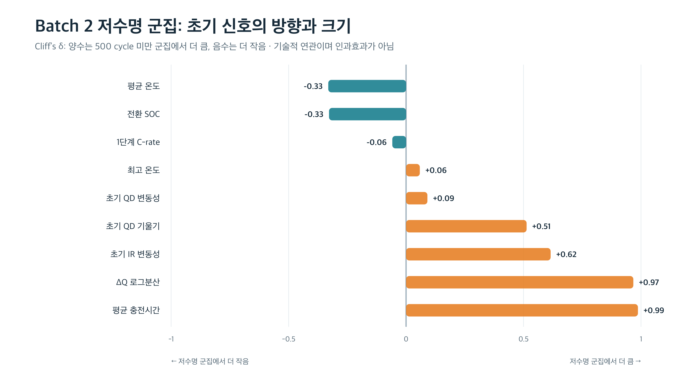

*Figure 4. Batch 2 저수명 군집과 나머지 Cell의 초기 Feature 차이. 양수는 저수명 군집에서 값이 더 큰 방향이다.*

| 초기 신호 | `<500` 중앙값 | `≥500` 중앙값 | Cliff’s δ | BH 보정 q값 | 읽는 방법 |
|---|---:|---:|---:|---:|---|
| 평균 충전시간 | 10.175 | 10.040 | **+0.987** | **<0.001** | 저수명 군집에서 거의 일관되게 큼 |
| ΔQ 로그분산 | -3.446 | -4.231 | **+0.968** | **<0.001** | 저수명 군집의 초기 곡선 변화가 큼 |
| 초기 IR 변동성 | 1.56×10⁻⁴ | 5.38×10⁻⁵ | **+0.615** | **0.004** | 저수명 군집의 저항 변동이 큼 |
| 초기 QD 기울기 | 3.34×10⁻⁵ | -4.81×10⁻⁵ | **+0.513** | **0.024** | 초기 변화 방향에 차이가 있음 |
| 1단계 C-rate | 5.2 | 5.2 | -0.058 | 1.000 | 중앙값과 분포 차이가 거의 없음 |

초기 QD 기울기가 일부 저수명 Cell에서 양수라는 사실은 배터리가 장기적으로 좋아졌다는 뜻이 아니다. 초기 conditioning이나 측정 안정화 과정에서는 용량이 잠시 증가해 보일 수 있고, 최종적으로는 이후의 가속 열화가 수명을 결정한다. 따라서 초기 기울기의 부호만으로 건강 상태를 단정하지 않고 다른 신호와 함께 본다.

#### 핵심 발견

- Batch 2의 짧은 수명은 **이상치 몇 개가 아니라 주된 군집**이다.
- 이 군집은 ΔQ 변화와 IR 변동성이 큰 방향으로 이미 초기 100 cycle 안에서 구분된다.
- 반면 1단계 C-rate 중앙값은 두 집단에서 모두 5.2로, 저수명을 단독으로 설명하지 못했다.

#### 해석과 한계

평균 충전시간과 초기 신호의 큰 차이는 저수명 군집을 기술하는 유용한 단서다. 하지만 **구분할 수 있다는 것과 원인을 알았다는 것은 다르다.** 예를 들어 저수명 Cell에서 충전시간이 더 길었다고 해서 긴 충전시간이 수명을 줄였다고 바로 말할 수 없다. 이미 열화가 시작돼 충전에 더 오래 걸렸을 수도 있고, 특정 정책이나 구조가 충전시간과 수명 모두에 영향을 줬을 수도 있다.

또한 평균 충전시간의 Cliff’s δ는 +0.987로 매우 크지만 중앙값의 절대 차이는 원자료 단위로 약 **0.135**다. 이는 두 집단의 값이 매우 일정하게 순서대로 분리됐다는 뜻이지, 물리적으로 반드시 큰 시간 차이라는 뜻은 아니다. 단위와 운영상 허용 범위를 함께 확인해야 실무적 중요성을 판단할 수 있다. IR 변동성은 결측 때문에 저수명 26개와 비교군 7개만 사용했으므로 다른 변수보다 불확실성이 크다.

정책, Cell 구조, Batch 시기가 동시에 달라져 있으므로 어느 하나를 원인으로 단정할 수 없다. 특히 `newstructure`는 오히려 Batch 내부의 **상단 수명 특이 Cell**에 집중됐다. 따라서 이 분석의 역할은 원인을 확정하는 것이 아니라, “짧은 수명 집단이 초기부터 어떤 모습으로 달랐는가”를 객관적으로 기술하고 Day 2의 후보 Feature를 찾는 데 있다.

> **Day 2 시사점**  
> Batch 1 내부 성능과 외부 Batch 성능을 분리해 보고한다. Batch 2의 낮은 수명 범위를 학습 데이터 밖의 분포 이동으로 인식하고, 평균 오차뿐 아니라 저수명 구간의 상대오차를 따로 점검한다.

---

### 3.2 Q2. 방전용량은 어떻게 감소하며, 열화는 가속되는가?

#### 질문

QD는 cycle에 따라 일정한 속도로 감소하는가, 아니면 어느 시점부터 급격히 감소하는가? 그리고 그 차이를 초기 100 cycle에서 볼 수 있는가?

> **한 문장 답**  
> 방전용량은 처음부터 같은 속도로 줄지 않았다. 대부분 한동안 완만하게 유지되다가 수명 후반의 knee 이후 급격히 감소했으며, 그 knee는 미래에 나타나므로 초기 예측 Feature로 사용할 수 없다.

#### 근거

먼저 전체 Cell의 QD를 각 Cell의 초기값 대비 비율로 바꾼 SOH 곡선을 확인했다. 이렇게 정규화하면 시작 용량이 조금씩 다른 Cell도 “처음보다 몇 % 남았는가”라는 같은 눈금에서 비교할 수 있다.

그다음 수명 그룹별 대표 Cell을 비교하고, 완만한 구간과 급격한 구간을 두 직선으로 나눴을 때 오차가 가장 작아지는 지점을 **Knee Point**로 탐색했다. Knee는 사람의 무릎처럼 곡선이 꺾이는 지점이라는 뜻이다. 배터리가 서서히 변하던 상태에서 눈에 띄게 빠른 용량 감소로 넘어가는 전환점으로 이해하면 된다.

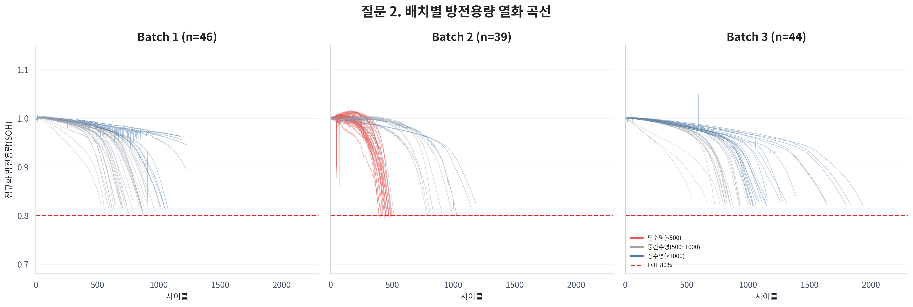

*Figure 5. 전체 Cell의 QD 기반 SOH 추이. 열화 속도와 급격한 하강 시점이 Cell마다 다르다.*

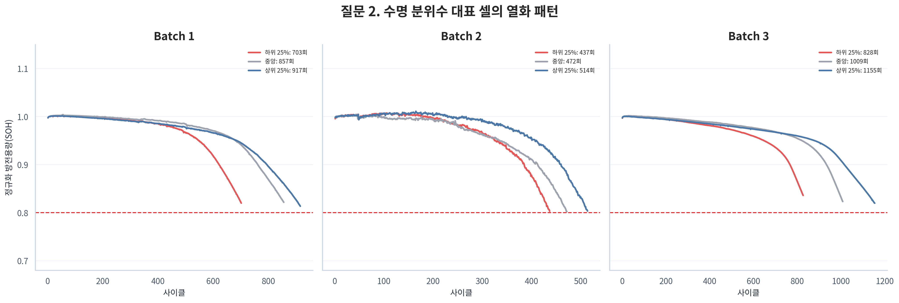

*Figure 6. 수명 그룹별 대표 열화곡선. 초기에는 곡선이 겹치지만 수명이 진행되면서 급격한 열화 시작 시점이 분리된다.*

초기 cycle 2~100의 QD 평균과 Cycle Life의 Batch별 Spearman ρ는 Batch 1 **0.242**, Batch 2 **0.117**, Batch 3 **0.162**로 약했다. QD 기울기는 Batch 1 **0.479**, Batch 2 **-0.271**, Batch 3 **0.088**로 방향도 일정하지 않았다.

이는 초기 100 cycle 동안 총 방전용량만 바라보면 장수명과 단수명 Cell이 아직 상당히 비슷해 보인다는 뜻이다. 건강 문제가 진행 중이어도 몸무게 하나만으로는 초기에 구분하기 어려운 것처럼, QD의 총량만으로는 미세한 내부 변화를 놓칠 수 있다.

반면 전체 수명곡선에서 계산한 knee는 다음처럼 나타났다.

| Batch | Knee 중앙값 | 수명 대비 Knee 비율 중앙값 | Knee 이후/이전 절대 기울기 비율 중앙값 |
|---|---:|---:|---:|
| Batch 1 | 601.0 cycle | 75.0% | 9.77배 |
| Batch 2 | 342.0 cycle | 74.7% | 11.47배 |
| Batch 3 | 819.5 cycle | 79.4% | 9.98배 |

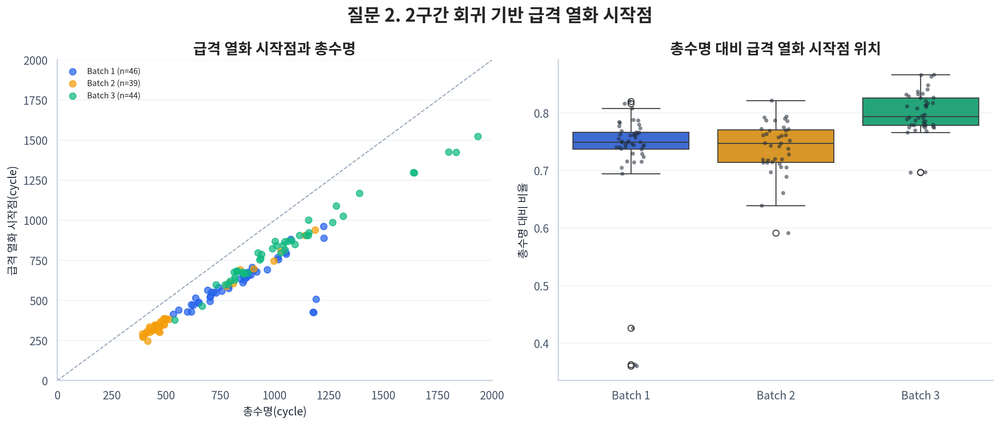

*Figure 7. Knee cycle은 최종 수명과 강하게 연결되지만 대부분 수명의 약 75~79% 지점에 나타난다.*

#### 핵심 발견

- 열화는 일정한 직선 감소가 아니라, 대체로 수명의 3/4 전후부터 **약 10배 가파르게** 진행됐다.
- Knee cycle과 Cycle Life의 상관은 **ρ=0.934**로 매우 강했다.
- 그러나 129개 중 3개는 자동 탐지 knee가 수명의 50% 이전에 있어, 개별 Cell의 knee 위치는 탐지 규칙에 민감할 수 있다.
- 초기 QD 평균과 기울기만으로는 세 Batch의 미래 수명을 일관되게 구분하기 어려웠다.

#### 해석과 한계

“Knee 이후 약 10배 가파르다”는 것은 knee 전후의 단위 cycle당 QD 감소 절대값을 비교했을 때 중앙값 기준으로 그 정도 차이가 났다는 뜻이다. 모든 Cell이 정확히 10배라는 뜻은 아니지만, 열화가 일정한 속도로 진행된다는 단순 가정은 적절하지 않음을 보여준다.

Knee는 실제 수명과 연결되는 강력한 열화 지표다. 그러나 강한 관계가 있다고 해서 좋은 **초기 예측 Feature**인 것은 아니다. 대부분 cycle 100보다 훨씬 뒤에 나타나므로 100 cycle 시점에는 아직 관찰할 수 없기 때문이다. 전체 곡선을 본 후 knee를 계산해 입력으로 넣는 것은, 시험이 끝난 뒤 공개되는 정답의 일부를 시험 전에 사용한 것과 같다. 이것이 **Data Leakage**다.

따라서 knee 분석의 목적은 “모델에 넣을 강력한 변수 찾기”가 아니라 **배터리 열화가 실제로 어떻게 진행되는지 이해하고, 미래정보를 초기정보와 구분하는 것**이다. 초기 예측에는 knee 자체가 아니라 knee가 오기 전 나타나는 미세한 전조 신호를 찾아야 한다.

> **Day 2 시사점**  
> 초기 QD는 단순 Baseline과 보조 Feature로 남긴다. Knee·EOL·전체 수명곡선 파생값은 성능이 좋아 보여도 입력에서 제외한다. 초기 100 cycle 안에서 더 민감한 변화인 ΔQ(V)를 핵심 후보로 검토한다.

---

### 3.3 Q3. ΔQ(V)는 초기부터 장수명과 단수명을 구분하는가?

#### 질문

Capacity 절대값이 비슷해 보이는 초기 구간에서도, 전압별 방전곡선이 변한 형태는 미래 수명 차이를 포착하는가?

> **한 문장 답**  
> 그렇다. 총 방전용량만 보면 비슷한 초기 Cell도 전압 구간별 변화의 ‘모양’을 보면 차이가 드러났고, 그 변화가 클수록 최종 수명은 짧았다.

#### 근거 — ΔQ(V)의 의미

Cycle 10과 100의 방전곡선을 공통 전압축에 맞춘 뒤 같은 전압에서 용량 차이를 계산했다.

> **ΔQ(V) = Q₁₀₀(V) − Q₁₀(V)**

일반 QD가 방전이 끝날 때까지 꺼낸 **전체 양**이라면, Q(V)는 그 용량이 3.5V, 3.4V처럼 각 전압 구간에서 어떤 모양으로 나타나는지를 보여주는 곡선이다. 총량이 비슷한 두 Cell도 곡선의 세부 모양은 다를 수 있다. ΔQ(V)는 cycle 10의 곡선과 cycle 100의 곡선을 같은 전압에서 뺀 값이므로, **90 cycle 동안 전압별 방전 특성이 얼마나 변했는가**를 보여주는 초기 열화의 지문에 가깝다.

수명 상위 25%와 하위 25%의 곡선을 Batch별로 비교하고, 길게 이어진 곡선을 모델에 넣을 수 있는 몇 개의 숫자로 요약하기 위해 분산·분위수·면적 Feature를 만들었다. 이는 심전도 전체 파형을 평균, 변동폭, 면적 같은 지표로 요약하는 것과 비슷하다.

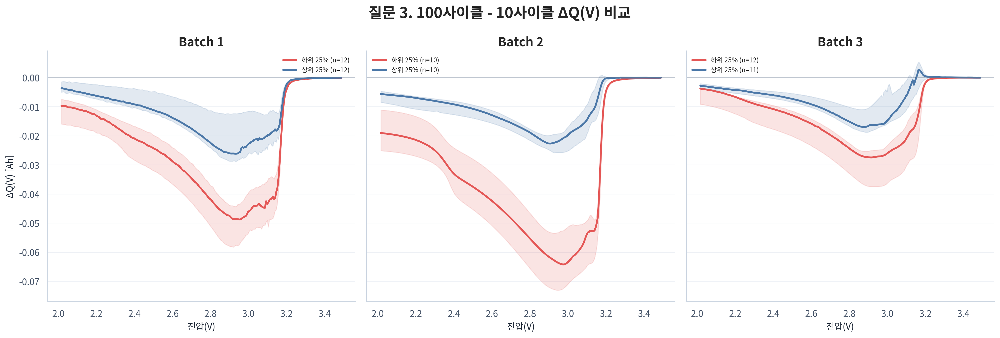

*Figure 8. 수명 상·하위 25%의 ΔQ(V). 단수명 그룹은 세 Batch에서 모두 변화 폭이 큰 방향으로 나타난다.*

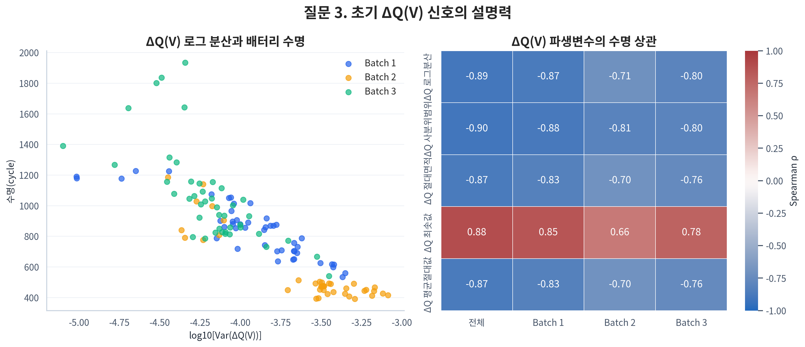

*Figure 9. ΔQ 로그분산이 커질수록 Cycle Life가 짧아지는 관계가 세 Batch에서 반복된다.*

| Batch | ΔQ 로그분산 vs Cycle Life ρ | 상·하위 25% Mann–Whitney p | 순위 효과크기 | 판단 |
|---|---:|---:|---:|---|
| Batch 1 | **-0.871** | 3.66×10⁻⁵ | -1.0 | 강한 음의 관계·분리 |
| Batch 2 | **-0.709** | 1.83×10⁻⁴ | -1.0 | 같은 방향 유지 |
| Batch 3 | **-0.797** | 5.55×10⁻⁵ | -1.0 | 같은 방향 유지 |

Mann–Whitney 검정은 두 집단의 값을 크기순으로 놓았을 때 순위가 체계적으로 다른지를 확인한다. 순위 효과크기 -1.0은 비교한 상·하위 25% 표본에서 ΔQ 로그분산 순위가 완전히 분리됐다는 뜻이다. 다만 전체 표본이 아닌 **극단 사분위 집단**을 비교한 결과이므로, 새로운 데이터에서도 완전 분리가 보장된다는 뜻은 아니다.

여기서 로그분산 값은 음수로 표시될 수 있다. 예를 들어 -3.4는 -4.2보다 큰 값이며 원래 분산도 더 크다. 따라서 “로그분산이 커질수록 수명이 짧다”는 말은 값이 0에 가까워질수록 cycle 10과 100의 곡선 차이가 더 크게 벌어졌다는 뜻이다. 음수 부호만 보고 열화가 작다고 해석하면 안 된다.

또한 상·하위 25%는 가장 긴 Cell과 가장 짧은 Cell을 의도적으로 떼어 비교한 것이다. 두 극단을 설명하는 데는 유용하지만, 수명이 중간인 Cell까지 같은 수준으로 잘 구분된다는 보장은 없다. 그래서 Day 2에서는 전체 연속형 수명을 대상으로 교차검증해야 한다.

#### 어떤 통계값을 Feature로 만들었는가?

| Feature | 무엇을 요약하는가? | 장점 | 주의점 |
|---|---|---|---|
| `delta_q_log10_var` | ΔQ(V) 분산의 로그값 | 범위 압축, 해석·수치 안정성 | `std`, `var`와 거의 같은 정보 |
| `delta_q_iqr` | ΔQ(V)의 중앙 50% 폭 | 극단값에 비교적 강함 | 다른 크기 지표와 중복 |
| `delta_q_min`, `q05`, `q25` | 음의 방향 변화의 크기 | 특정 전압대 변화 반영 | 서로 높은 상관 가능 |
| `delta_q_area`, `abs_area` | 곡선의 부호 포함/절대 면적 | 전체 형태를 한 값으로 요약 | 곡선 크기 지표와 중복 |
| `delta_q_l1`, `l2` | 전체 변화량의 거리 | 변화 규모에 민감 | 면적·분산과 중복 |

#### 핵심 발견

- ΔQ 로그분산은 전체 데이터에서도 Cycle Life와 **ρ=-0.892**였다.
- `delta_q_iqr`은 전체 ρ=-0.899로 조금 더 컸지만, ΔQ 파생값 12개가 Batch 1에서 하나의 고상관 연결군을 형성했다.
- 따라서 “상관이 가장 큰 숫자 하나”를 기계적으로 고르기보다, 안정성과 해석성이 좋은 대표값을 선택해야 한다.

#### 해석과 한계

ΔQ(V)가 유용한 이유는 “전체 용량이 아직 비슷하다”는 사실 뒤에 숨은 전압별 변화를 확대해 보여주기 때문이다. 즉 QD 평균이 배터리 건강의 굵은 윤곽이라면, ΔQ(V)는 그 안의 미세한 질감이다. 세 Batch에서 관계 방향이 반복됐다는 점 때문에 단일 Batch에서만 우연히 나타난 신호보다 일반화 후보로 더 설득력이 있다.

그러나 이 역시 수명과의 **연관성**이다. ΔQ(V)가 수명을 줄였다는 뜻이 아니라, 내부 열화가 진행될 때 ΔQ(V)와 최종 수명이 함께 달라졌을 가능성이 크다. 어떤 화학적 반응이나 손실 메커니즘이 이 곡선 변화를 만들었는지 확정하려면 전압 구간별 전기화학 해석과 독립 실험이 추가로 필요하다.

> **Day 2 시사점**  
> `delta_q_log10_var`를 설명 가능한 대표 Core Feature로 시작한다. `delta_q_iqr`, `delta_q_min`, 면적 계열은 대체 후보로 비교하되 한꺼번에 모두 투입하지 않는다. 최종 선택은 Batch 1 CV에서의 MAPE와 안정성으로 결정한다.

---

### 3.4 Q4. 충전 조건과 수명·열화는 어떤 관계인가?

#### 질문

고속 충전 Cell은 실제로 더 짧게 사는가? 충전 전류 패턴은 최종 수명뿐 아니라 초기 ΔQ 변화나 QD 기울기와도 연결되는가?

> **한 문장 답**  
> 빠른 충전과 큰 초기 ΔQ 변화는 함께 나타났지만, 빠른 충전과 짧은 최종 수명의 직접 관계는 Batch마다 달랐다. 따라서 충전 속도 하나만으로 수명을 설명할 수 없다.

#### 근거

**C-rate**는 배터리 정격용량에 비해 얼마나 큰 전류로 충전하는지를 나타낸다. 개념적으로 1C는 정격용량과 같은 크기의 전류, 5C는 그보다 다섯 배 큰 전류를 뜻하므로 값이 클수록 빠른 충전 조건이다. 이 데이터의 충전 정책은 처음부터 끝까지 하나의 속도를 쓰지 않고, 일정 SOC에서 속도를 바꾸는 2단계 방식이 많다.

따라서 정책 문자열을 **1단계 C-rate, 전환 SOC, 2단계 C-rate**로 분해했다. 예를 들어 “5.2C로 시작해 SOC 58%에서 4C로 전환”하는 정책이라면 세 숫자를 각각 보존하는 방식이다. 정책별 평균 수명은 표본 수와 bootstrap 95% 신뢰구간을 함께 표시했다. Bootstrap은 현재 표본을 반복해서 다시 뽑아 평균이 얼마나 흔들리는지 추정하는 방법이다. 이어 충전 변수와 Cycle Life뿐 아니라 초기 열화의 대리지표인 `delta_q_log10_var`, `qd_slope`의 관계도 확인했다.

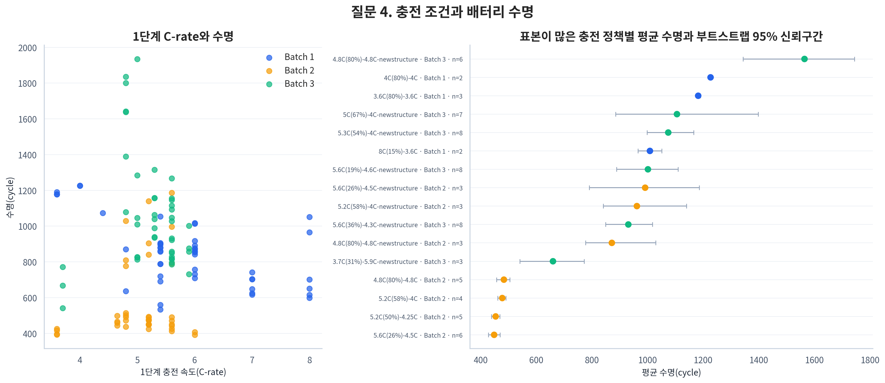

*Figure 10. 같은 C-rate에서도 수명이 넓게 퍼지고, 표본이 적은 정책은 평균의 불확실성이 크다.*

| 범위 | 1단계 C-rate vs Cycle Life ρ | 해석 |
|---|---:|---|
| 전체 | **-0.027** | 사실상 관계 없음 |
| Batch 1 | **-0.483** | 높은 C-rate와 짧은 수명이 함께 나타남 |
| Batch 2 | **+0.055** | 매우 약하고 방향이 다름 |
| Batch 3 | **-0.229** | 음의 방향이지만 약함 |
| Batch 보정 | **-0.226** | 약한 음의 관계, 보정 q=0.026 |

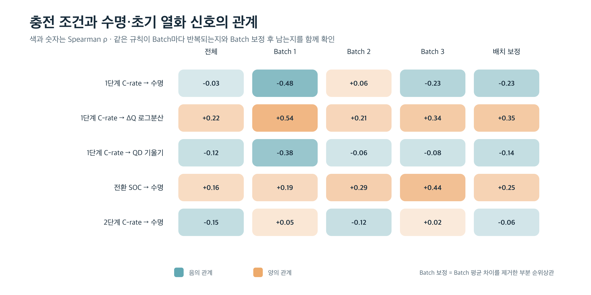

*Figure 11. 충전 조건과 수명·열화 대리지표의 Spearman ρ. ‘수명’과의 직접 관계보다 ‘ΔQ 변화’와의 관계가 더 일관적이다.*

표의 **Batch 보정**은 Batch 1·2·3의 평균적인 차이를 먼저 제거한 뒤, 같은 Batch 안에서 충전 조건과 신호가 함께 움직이는지를 다시 계산한 값이다. 세 반의 시험 난이도가 다를 때 반별 평균 차이를 그대로 섞지 않고, 각 반 안에서 공부시간과 점수의 관계를 보는 것과 비슷하다. 다만 측정하지 못한 Cell 구조나 세부 실험조건까지 모두 제거해 주는 것은 아니다.

#### 고속 충전 가설을 어떻게 읽어야 하는가?

- **최종 수명:** 1단계 C-rate와 Cycle Life의 관계는 Batch 1에서는 뚜렷했지만 Batch 2에서는 사라졌다. 전체 ρ=-0.027만 보면 관계가 없다고 결론 내릴 수 있지만, 이는 Batch별 방향 차이가 상쇄된 결과다.
- **ΔQ 변화:** 1단계 C-rate와 ΔQ 로그분산은 Batch 1 **0.540**, Batch 2 **0.214**, Batch 3 **0.337**로 모두 양의 방향이었다. Batch 차이를 제거한 부분 순위상관도 **0.348**(보정 q=0.002)이었다.
- **초기 QD 기울기:** 1단계 C-rate와의 관계는 Batch 1 -0.379, Batch 2 -0.060, Batch 3 -0.082로 약하거나 불안정했다.
- **2단계 C-rate:** 최종 수명과의 관계는 Batch 보정 후에도 ρ=-0.057로 매우 약했다.

#### 핵심 발견

“C-rate가 높으면 반드시 수명이 짧다”는 단일 규칙은 지지되지 않았다. 그러나 높은 1단계 C-rate가 ΔQ 변화가 큰 방향과 연결된 결과는, 충전 조건이 **초기 열화 신호를 거쳐 수명과 연결될 가능성**을 보여준다.

이를 하나의 가능한 이야기로 쓰면 `높은 1단계 C-rate → 더 큰 초기 ΔQ 변화 → 짧은 수명`이다. 하지만 현재 분석이 확인한 것은 이 화살표 전체가 아니라 **첫 번째와 두 번째 관계가 각각 관찰됐다는 사실**뿐이다. ΔQ가 실제로 중간 경로 역할을 하는지 증명하려면 매개효과 분석이나 충전 조건을 통제한 별도 실험이 필요하다.

#### 해석과 한계

이 경로는 매개효과나 인과효과가 확인된 것이 아니다. C-rate 수준은 정책·전환 SOC·Cell 구조·실험 Batch와 독립적으로 무작위 배정된 변수가 아니므로 **교란(confounding)** 가능성이 크다. 교란은 제3의 조건이 두 변수에 동시에 영향을 줘 마치 직접 관계가 있는 것처럼 보이게 하는 현상이다. 예를 들어 특정 Cell 구조에만 높은 C-rate를 적용했다면 구조 효과와 충전 속도 효과를 관찰 데이터만으로 분리하기 어렵다.

또한 일부 정책은 Cell 수가 1~2개뿐이다. 이때 평균 수명이 매우 높거나 낮아도 정책의 일반적인 효과라기보다 그 Cell 하나의 특성일 수 있다. Figure 10에서 신뢰구간이 넓은 정책은 바로 이런 불확실성을 나타낸다.

> **Day 2 시사점**  
> 정책 문자열 자체를 범주형 Core Feature로 고정하지 않는다. 1단계 C-rate·전환 SOC·2단계 C-rate를 연속형 후보로 만들고, ΔQ 모델에 추가했을 때 같은 교차검증 분할에서 MAPE가 실제로 줄어드는지 확인한다. 충전 Feature의 성능 기여가 없으면 과감히 제외한다.

---

### 3.5 Q5. 어떤 신호가 수명과 연관되며, 중복은 어떻게 줄일 것인가?

#### 질문

초기 100 cycle Feature 중 어떤 신호가 Cycle Life와 강하게 연결되는가? 그 관계는 Batch마다 유지되는가? 여러 Feature가 같은 정보를 반복하는 다중공선성 문제는 어떻게 통제할 것인가?

> **한 문장 답**  
> ΔQ 계열이 가장 강하고 일관됐지만 서로 거의 같은 정보를 반복했다. 따라서 상관이 높은 Feature를 많이 넣는 것이 아니라, 각 정보군에서 대표값을 고르고 실제 예측오차가 줄어드는지 확인해야 한다.

#### 근거 — Target과의 관계

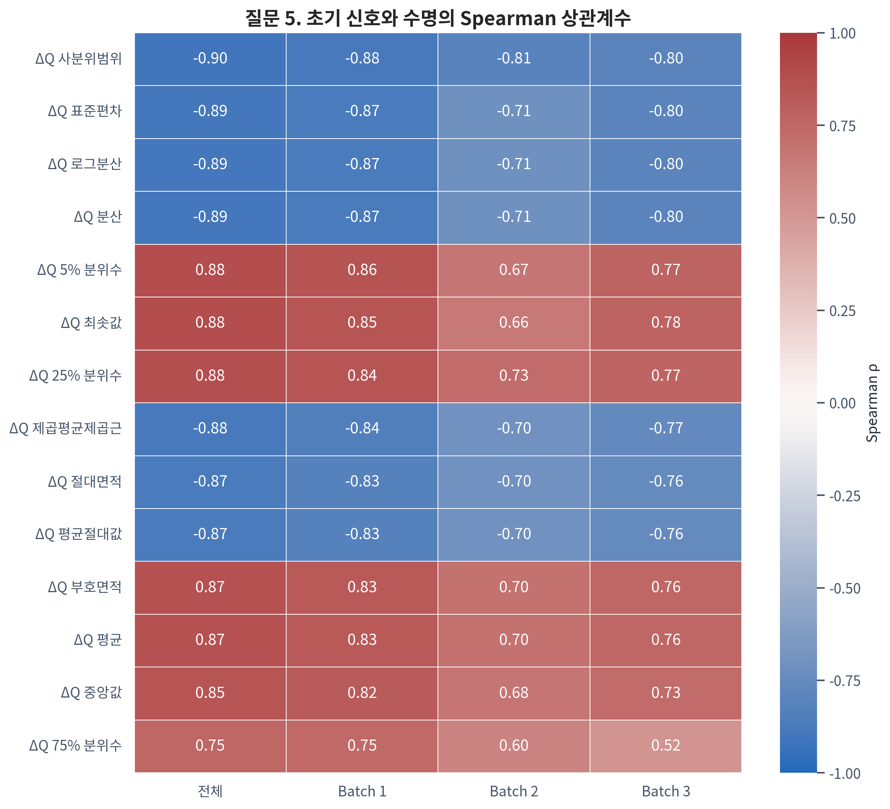

*Figure 12. 초기 Feature와 Cycle Life의 Spearman ρ. 전체 상관의 크기보다 Batch별 방향 유지 여부가 중요하다.*

| Feature | 전체 | Batch 1 | Batch 2 | Batch 3 | 판단 |
|---|---:|---:|---:|---:|---|
| `delta_q_iqr` | **-0.899** | **-0.879** | **-0.810** | **-0.800** | 강하고 방향이 일관됨 |
| `delta_q_log10_var` | **-0.892** | **-0.871** | **-0.709** | **-0.797** | 강하고 방향이 일관됨 |
| `ir_std` | -0.583 | -0.443 | -0.433 | -0.183 | 방향은 같지만 강도가 약화 |
| `qd_std` | -0.538 | +0.055 | -0.101 | -0.276 | 전체 상관이 Batch 내부 관계를 과장 |
| `chargetime_median` | -0.028 | **+0.641** | **-0.810** | +0.261 | Batch마다 방향이 크게 다름 |
| `qd_slope` | -0.184 | +0.479 | -0.271 | +0.088 | 일반화가 어려움 |
| `tavg_slope` | +0.399 | -0.546 | +0.085 | +0.105 | 전체와 Batch 1 방향도 다름 |
| `c_rate_stage1` | -0.027 | -0.483 | +0.055 | -0.229 | 단독 규칙으로 불안정 |

이 표는 전체 데이터를 한꺼번에 합쳐 분석할 때 생기는 위험을 보여준다. 예를 들어 `qd_std`는 전체 ρ=-0.538로 꽤 커 보이지만 각 Batch 안에서는 관계가 약하다. 이것은 `qd_std`가 개별 Cell의 수명을 설명했다기보다, 평균적인 `qd_std`와 수명이 모두 다른 Batch를 구분했기 때문에 생긴 상관일 수 있다.

쉽게 말해 서로 다른 세 도시의 집값과 기온을 합치면 강한 관계가 보여도, 각 도시 안에서는 관계가 없을 수 있다. 도시 자체의 차이가 두 값을 함께 움직인 것이다. 배터리에서는 Batch가 그 ‘도시’ 역할을 할 수 있다. 반대로 `chargetime_median`은 Batch 1에서는 수명과 양의 관계, Batch 2에서는 강한 음의 관계여서 하나의 공통 규칙으로 해석하기 어렵다. 따라서 **전체 통합 상관이 크다는 이유만으로 Feature를 선택하지 않는다.**

#### 근거 — Feature 간 중복

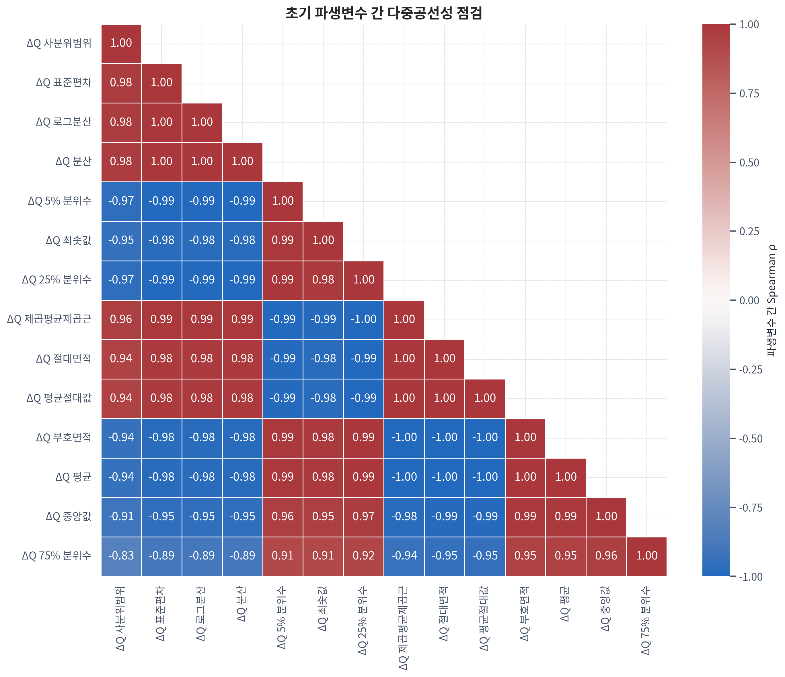

*Figure 13. Feature 간 상관행렬. ΔQ 크기 계열과 같은 파생 Feature는 사실상 같은 정보를 반복한다.*

Day 2 학습 데이터인 Batch 1에서 `|Spearman ρ|≥0.90`인 Feature를 연결해 중복군을 만들었다.

| 중복군 | Feature 수 | 주요 구성 | 대표 후보 | 선정 이유 |
|---|---:|---|---|---|
| ΔQ 크기 | 12 | log variance, variance, std, IQR, L1/L2, 면적, 분위수 | `delta_q_log10_var` | 강한 Target 관계, 로그 변환의 수치 안정성, 설명 용이성 |
| 온도 수준 | 8 | Tavg/Tmax의 mean·median·min·max | `tavg_mean` | 가장 단순하고 해석 가능한 수준값 |
| QD/QC 수준 | 6 | QD mean·median·min·max, QC 일부 | `qd_mean` | Capacity Baseline으로 직관적 |
| 충전시간 수준 | 4 | mean·median·min·max | `chargetime_mean` | 평균 충전시간으로 해석하기 쉬움 |
| Capacity 변화 | 4 | QD/QC delta·slope | `qd_slope` | cycle당 변화량으로 방향 해석 가능 |
| IR 수준 | 3 | mean·median·max | `ir_mean` | 저항 수준 대표값 |

연결군은 모든 Feature 쌍이 반드시 0.90 이상이라는 뜻이 아니라, **0.90 이상인 관계를 따라 하나의 정보 묶음으로 연결됐다**는 뜻이다. 한 군에서 여러 변수를 동시에 넣으면 표본 수 46개에 비해 계수가 불안정해질 수 있다.

왜 중복이 문제가 되는지 예를 들어 보자. 같은 방의 온도를 섭씨, 화씨, 소수점 반올림 전·후 값으로 여러 번 넣어도 새로운 정보가 늘어난 것은 아니다. 그런데 선형모델은 서로 비슷한 변수 중 어느 쪽에 얼마의 책임을 줄지 결정하기 어려워 계수가 크게 흔들릴 수 있다. 이를 **다중공선성**이라고 한다. 예측값이 우연히 비슷하게 유지되더라도 “어떤 Feature가 중요했는가”라는 설명은 불안정해진다.

ΔQ 분산·표준편차·로그분산이 대표적인 예다. 계산식은 다르지만 같은 곡선의 변동 크기를 표현하므로 함께 많이 넣는다고 독립적인 증거가 늘지 않는다. 이 때문에 각 중복군에서 해석하기 쉽고 수치적으로 안정적인 대표값을 먼저 고른다.

#### 객관적인 Feature 선정 규칙

다음 규칙은 “분석자가 좋아 보이는 변수를 임의로 고른다”는 인상을 줄이기 위한 사전 기준이다. 각 규칙은 서로 다른 실패 가능성을 막는다.

1. **가용성:** cycle 100 이전에 계산 가능하고 결측률이 허용 가능한가?
2. **누수 방지:** Knee·EOL처럼 미래를 본 값은 제외했는가?
3. **Batch 1 근거:** 최종 선택과 모델 설정값 조정은 학습 Batch 안에서만 했는가?
4. **중복 제거:** Batch 1의 `|ρ|≥0.90` 중복군에서 해석 가능한 대표값을 우선했는가?
5. **추가 가치:** 동일한 교차검증 분할에서 새 Feature군을 넣었을 때 MAPE가 실제로 줄었는가?
6. **안정성:** 평균 MAPE뿐 아니라 fold 편차, 계수 방향, Hold-out gap이 안정적인가?

즉, 상관관계는 후보를 찾는 **1차 필터**이고, 중복 제거는 같은 정보를 반복하지 않게 하는 **정리 단계**, 교차검증 Ablation은 그 Feature가 실제 예측에 도움이 되는지 확인하는 **최종 시험**이다.

#### 해석과 한계

OLS는 다른 변수를 고정했을 때 각 Feature가 Target과 어떤 선형 관계를 갖는지 계수와 p값으로 보여주는 유용한 모델이다. 그러나 이번처럼 학습 Cell이 46개뿐이고 비슷한 Feature가 많은 상황에서는, 데이터 몇 개나 중복 변수 하나가 바뀌는 것만으로 계수 부호와 p값이 크게 흔들릴 수 있다. 따라서 “p<0.05인 Feature만 남긴다”는 방식은 객관적으로 보이지만 실제로는 불안정할 수 있다.

VIF는 한 Feature가 나머지 Feature로 얼마나 잘 설명되는지를 측정해 중복 정도를 알려준다. 대표 Feature를 고른 뒤 VIF를 보조 진단으로 확인하는 것은 유용하지만, VIF가 낮다고 예측력이 보장되는 것은 아니다. 그래서 최종 근거는 계수를 부드럽게 줄이는 **Ridge·ElasticNet 규제**와, 같은 데이터 분할에서 Feature군을 넣고 빼며 성능 차이를 보는 **교차검증 Ablation**으로 둔다.

#### 핵심 발견

세 Batch에서 가장 강하고 방향이 안정적인 Feature군은 ΔQ(V)였다. 다른 센서·충전 Feature는 일부 유용한 신호가 있지만 Batch에 따라 관계가 달라 **Core가 아니라 Incremental 후보**로 보는 것이 타당하다.

> **Day 2 시사점**  
> 높은 상관 Feature를 많이 넣지 않는다. ΔQ 대표값에서 시작해 서로 다른 정보군을 하나씩 추가하고, Ridge·ElasticNet과 Ablation으로 추가 변수가 실제 예측 성능을 높이는지 확인한다.

---

## 4. 다섯 질문을 하나의 이야기로 연결하면

| 질문 | 객관적 발견 | 해석 | Day 2 결정 |
|---|---|---|---|
| Cycle Life 분포 | Batch 중앙값 472.0~1,005.5, 분포 차이 p<10⁻¹¹ | 학습·외부 데이터의 분포가 다름 | Batch별 성능 분리 보고 |
| 열화 곡선 | Knee 이후 기울기가 약 10배 가팔라짐 | 열화는 일정하지 않고 후반에 가속 | Knee는 설명용, 입력 금지 |
| ΔQ(V) | 로그분산 ρ=-0.871/-0.709/-0.797 | 초기 곡선 변화가 미래 수명과 연결 | Core Feature군 |
| Charging | 수명 관계는 불일치, ΔQ 관계는 같은 양의 방향 | 단독 원인은 아니나 초기 열화 경로 후보 | 연속형 Incremental 후보 |
| 상관·중복 | ΔQ 파생 12개가 고상관 연결군 | Feature 수보다 독립 정보가 중요 | 대표값 + 규제 + Ablation |

### 분석의 논리 사슬

1. **먼저 Target을 확인했다.** Batch별 수명 범위가 다르므로 외부 일반화가 이 프로젝트의 핵심 난제임을 알았다.
2. **가장 직관적인 QD를 확인했다.** 수명 후반의 가속 열화는 분명했지만, 초기 QD만으로는 미래 차이가 뚜렷하지 않았다.
3. **더 민감한 초기 신호를 찾았다.** 총량이 아닌 전압별 곡선 변화인 ΔQ(V)에서 세 Batch에 걸친 일관된 관계를 발견했다.
4. **운영 조건을 연결했다.** 충전 속도는 ΔQ 변화와 연결됐지만 최종 수명과의 직접 관계는 불안정해, 원인으로 단정하지 않고 보조 후보로 남겼다.
5. **비슷한 Feature를 정리했다.** 같은 ΔQ 곡선에서 나온 여러 통계량이 중복되므로 대표값만 우선 사용하기로 했다.
6. **Day 2 실험을 설계했다.** 단순 Baseline에서 시작해 새 정보가 외부 예측을 실제로 개선할 때만 모델에 남긴다.

이 사슬에서 관찰 결과와 의사결정을 분리했다. 예를 들어 “ΔQ가 수명과 강하게 연관됐다”는 Day 1의 관찰이고, “ΔQ를 Core Feature로 먼저 시험한다”는 그 관찰에 근거한 Day 2 결정이다. 반면 “ΔQ가 수명을 짧게 만든다”는 주장은 현재 데이터로 증명하지 않았으므로 하지 않는다.

> **EDA가 만든 최종 논리**  
> 초기 Capacity의 절대 수준만으로는 미래 수명 차이가 잘 드러나지 않았다. 전체 수명에서는 knee 이후 열화 가속이 수명을 설명하지만 예측 시점에 알 수 없다. 반면 초기 100 cycle 안에서 계산 가능한 ΔQ(V)는 세 Batch에서 일관된 관계를 보였다. 따라서 Day 2는 ΔQ를 중심에 두고 Capacity·Sensor·Charging의 추가 가치를 엄격하게 검증하는 Regression 문제로 진행한다.

---

## 5. Day 2 Feature Engineering Strategy

Feature Engineering은 원본 센서 기록을 모델이 사용할 수 있는 요약 숫자로 바꾸는 과정이다. 이 보고서에서는 Feature를 세 역할로 나눈다. **Baseline**은 가장 단순한 출발점, **Core**는 Day 1에서 가장 강한 근거를 얻은 중심 정보, **Incremental**은 Core에 더했을 때 추가 이익이 있는지 시험할 후보라는 뜻이다. 이 구분은 중요도가 이미 확정됐다는 선언이 아니라, Day 2 실험 순서를 명확하게 만드는 장치다.

### 5.1 Core — ΔQ(V)

`delta_q_log10_var`를 첫 대표 후보로 둔다. cycle 10과 100만 사용해 누수 위험이 낮고, 세 Batch에서 같은 방향의 강한 관계를 보였다. `delta_q_iqr`, `delta_q_min`, 면적 계열은 대체 후보로 비교하되 동시에 모두 고정 투입하지 않는다.

### 5.2 Baseline — 초기 Capacity

`qd_mean`과 `qd_slope`로 가장 단순한 기준을 만든다. 단독 설명력은 제한적이지만 ΔQ가 Capacity Baseline 대비 실제로 얼마나 개선되는지 보여주는 기준이다.

### 5.3 Incremental — Sensor와 Charging

IR, Temperature, Charge Time, C-rate, switch SOC는 추가 정보를 줄 가능성이 있다. 하지만 Batch별 관계가 불안정하므로 한꺼번에 넣지 않고 정보군별 대표값을 단계적으로 추가한다.

### 5.4 제외 — 미래정보와 중복정보

- Knee cycle, EOL 시점, 전체 수명곡선 파생값, cycle 100 이후 측정값은 **미래정보**이므로 제외한다.
- 같은 중복군에서 나온 mean·median·min·max 또는 ΔQ 분산·표준편차·로그분산을 동시에 무분별하게 넣지 않는다.
- 원본 Charging Policy 문자열은 표본이 작은 범주가 많아 Core Feature로 고정하지 않는다.

| Feature군 | 역할 | Day 1 근거 | Day 2 사용 방식 |
|---|---|---|---|
| ΔQ(V) | Core | 강하고 Batch별 방향이 일관됨 | 대표값 1개부터 시작, 대체 후보 비교 |
| Capacity | Baseline | 초기 절대값 관계가 제한적 | ΔQ의 증분 성능 기준 |
| IR·Temperature·Charge Time | Incremental | 일부 신호 있으나 불안정·중복 | 군별 대표값만 추가 |
| Charging | Incremental | ΔQ와 연관 가능, 수명 관계는 불일치 | 연속형 변수의 추가 가치 확인 |
| Knee·EOL | 제외 | 미래정보 필요 | 사용 금지 |

---

## 6. 왜 Regression이며, 왜 이 모델들인가?

Classification은 Cell을 “장수명/단수명” 같은 등급으로 나눈다. Regression은 **총 몇 cycle까지 사용할 수 있는지 연속적인 숫자**로 예측한다. ESS 유지보수와 교체 시점을 정량적으로 판단하려면 등급보다 예상 cycle 수가 직접적이므로 Regression이 과제 목표에 맞다.

주 평가지표는 **MAPE(Mean Absolute Percentage Error)**다. 실제 수명 대비 오차를 백분율로 보여준다. 예를 들어 실제 수명이 1,000 cycle인 Cell을 900으로 예측했다면 절대 백분율 오차는 10%다. 여러 Cell의 이 비율을 평균한 값이 MAPE다. 서로 다른 수명 구간을 같은 백분율 눈금으로 비교하기 쉽지만, 실제 수명이 작은 Cell에서는 같은 100 cycle 오차도 더 크게 계산된다. 따라서 MAE와 예측-실제 산점도도 함께 확인한다.

| 모델 | 선정 이유 | 확인할 위험 |
|---|---|---|
| Median Baseline | ML이 단순 대표값보다 나은지 확인 | 낮은 기준선 |
| Linear Regression | 가장 단순한 선형 관계와 계수 방향 확인 | 공선성·과적합 |
| Ridge | 중복 Feature의 계수를 안정화 | 모든 변수를 남김 |
| ElasticNet | 계수 축소와 일부 Feature 선택을 함께 검토 | 작은 표본에서 튜닝 민감 |
| Gradient Boosting 또는 LightGBM | 비선형 관계와 상호작용 확인 | 표본 46개에서 과적합 위험 |

모델 비교의 순서에도 이유가 있다. Median Baseline은 아무 Feature도 보지 않고 대표 수명만 말하는 최저 기준이다. Linear Regression은 관계를 가장 단순하고 투명하게 보여준다. Ridge와 ElasticNet은 비슷한 Feature가 많을 때 계수가 지나치게 커지지 않도록 제동을 건다. Gradient Boosting은 직선으로 표현하기 어려운 관계를 찾을 수 있지만, 작은 표본의 우연한 패턴까지 외울 위험이 있어 깊이와 반복 수를 제한해야 한다.

여기서 **과적합**은 연습문제의 답은 거의 외웠지만 새로운 문제는 잘 풀지 못하는 상태다. Day 2의 목표는 Batch 1을 완벽히 맞히는 모델이 아니라, 보지 않은 Cell과 다른 Batch에서도 오차가 크게 무너지지 않는 모델이다.

Deep Learning은 우선 후보에서 제외한다. cycle 기록은 많지만 독립 학습 Sample은 Cell 46개이므로 큰 신경망의 복잡도를 뒷받침할 표본이 부족하다. 정형 데이터의 작은 표본에서는 규제된 선형모델과 제한된 복잡도의 Tree Model을 먼저 비교하는 편이 자원과 일반화 측면에서 합리적이다.

원논문의 테스트 오차 **9.1%**는 참고 기준으로만 사용한다. 전처리, Feature, 데이터 분할 조건이 완전히 같지 않으므로 동일 조건 재현이라고 표현하지 않는다.

---

## 7. Feature Ablation — 선정 이유를 성능으로 증명하기

**Ablation**은 Feature를 한꺼번에 모두 넣는 대신, 정보군을 하나씩 추가하거나 제거해 무엇이 실제 개선을 만들었는지 확인하는 실험이다. 요리에 재료를 한 번에 바꾸지 않고 하나씩 추가해 맛의 변화를 확인하는 것과 같다. F0에서 F4로 갈수록 모델이 보는 정보가 늘어나며, 각 단계의 성능 차이가 그 Feature군의 추가 가치를 보여준다.

| 단계 | 사용 Feature군 | 확인할 질문 |
|---|---|---|
| F0 | Capacity Baseline | 단순 초기 용량만으로 어느 정도 예측되는가? |
| F1 | ΔQ 대표값 | ΔQ가 F0보다 MAPE를 줄이는가? |
| F2 | ΔQ + Capacity trend | 용량 변화 속도가 추가 정보를 주는가? |
| F3 | F2 + Sensor 대표값 | IR·Temperature·Charge Time이 개선을 만드는가? |
| F4 | F3 + Charging | C-rate·switch SOC가 마지막 추가 가치를 주는가? |

모든 단계는 **동일한 CV split**을 사용한다. CV(Cross-Validation)는 학습 데이터를 여러 조각으로 나눠 일부로 학습하고 나머지로 검증하는 과정을 번갈아 반복하는 방법이다. 동일한 split을 쓴다는 것은 F0와 F1이 매번 같은 Cell에서 시험을 치르게 한다는 뜻이다. 그래야 성능 차이가 Feature 때문인지, 우연히 쉬운 Cell이 검증 세트에 들어갔기 때문인지 구분할 수 있다. 다음 조건을 모두 만족할 때만 새 Feature군을 남긴다.

- 평균 MAPE가 감소한다.
- fold별 편차가 과도하게 커지지 않는다.
- 고정 Hold-out과의 성능 gap이 악화되지 않는다.
- Feature 수 증가에 비해 개선 폭이 의미 있다.
- 계수 또는 중요도가 데이터 분할마다 완전히 뒤집히지 않는다.

---

## 8. Validation Strategy — 일반화와 누수를 분리하기

검증 구조는 **연습 → 모의고사 → 외부 시험**의 순서로 이해할 수 있다. Batch 1 CV는 여러 번 반복하는 연습시험, Batch 1 고정 Hold-out은 모델 선택 후 확인하는 모의고사, Batch 2는 다른 환경에서 치르는 외부 시험이다. Batch 3은 환경이 더 바뀌어도 결론이 유지되는지 보는 추가 시험이다.

**Batch 1 모델 개발**  
→ **Batch 1 CV:** Feature군·모델·규제 강도 비교  
→ **Batch 1 고정 Hold-out:** 선택된 조합 점검  
→ **모든 선택 고정**  
→ **Batch 2 외부 Batch 평가**  
→ **Batch 3 추가 일반화 분석**

### Data Leakage 방지 체크리스트

- 모델 입력은 cycle 100까지의 정보만 사용한다.
- Knee, EOL, `cycle_life` 파생값을 사용하지 않는다.
- Cell 한 개를 Sample 한 개로 유지하고 같은 Cell을 Train과 Validation 양쪽에 넣지 않는다.
- 결측치 처리기(Imputer), 척도 변환기(Scaler), 범주 인코더(Encoder), Feature 선택기는 전체 데이터가 아니라 각 학습 분할에서만 맞춘다.
- Batch 2·3 정답을 보고 Feature나 모델 설정값을 다시 고르지 않는다.
- 외부 평가가 낮아도 그 결과를 다시 학습 선택에 되먹임하지 않고 분포 이동의 결과로 보고한다.

최종 선택은 CV 평균 MAPE 하나로 끝내지 않는다. **MAPE 평균±표준편차, MAE, Hold-out gap, 외부 Batch 성능, Feature 수, 설명 가능성**을 함께 보고한다.

여기서 평균 MAPE는 전반적인 정확도, 표준편차는 데이터 분할에 따른 흔들림, Hold-out gap은 연습 성능과 모의고사 성능의 차이를 뜻한다. 평균이 조금 더 좋아도 흔들림이 매우 크거나 외부 Batch에서 급격히 나빠진다면 더 좋은 모델이라고 보기 어렵다. 작은 데이터에서는 최고 점수 한 번보다 **여러 번 비슷한 점수를 내는 안정성**이 더 중요하다.

---

## 9. 평가요소에 대한 직접 대응

### EDA — 그래프가 질문과 해석에 맞는가?

- Histogram·누적분포: Batch별 Target 범위와 분포 이동을 확인했다.
- Violin·비율 막대: 단수명/장수명 구성 차이를 수치와 형태로 함께 보여줬다.
- 열화곡선·Knee plot: QD 감소의 비선형성과 가속 시점을 설명했다.
- ΔQ 곡선·산점도: 초기 곡선 형태와 수명의 관계를 직접 확인했다.
- 상관 Heatmap: 전체 상관과 Batch별 방향 차이, Feature 중복을 비교했다.
- 모든 해석에서 그래프의 관찰, 통계 근거, 한계, Day 2 결정을 연결했다.

### 머신러닝 — 모델 선정 이유가 논리적인가?

작은 Cell 표본, 정형 데이터, 높은 공선성, 비선형 가능성을 기준으로 Baseline → 선형 → 규제 선형 → 제한된 비선형 모델 순으로 비교한다. 독립 표본이 46개인 상황에서 Deep Learning을 우선하지 않는 이유도 표본 복잡도 관점에서 명시했다.

### Feature — 선정 이유가 객관적인가?

- Target과의 관계 크기만이 아니라 Batch별 방향과 결측을 확인했다.
- 미래정보를 제외했다.
- Batch 1 내부 `|ρ|≥0.90` 중복군에서 대표값을 선택했다.
- 규제 모델로 계수 불안정을 줄인다.
- 동일한 교차검증 분할의 F0~F4 Ablation으로 실제 MAPE 개선을 확인한다.
- OLS/VIF는 보조 진단으로 사용하고, 작은 표본에서 불안정한 개별 p값을 최종 선정 근거로 삼지 않는다.

---

## 10. 한계와 다음 단계

- **독립 Sample 수가 작다.** 복잡한 모델의 작은 성능 차이는 데이터 분할에 따라 달라질 수 있으므로 평균과 편차를 함께 보고 단순한 모델을 우선한다.
- **정책별 Sample은 더 작다.** Charging Policy 평균 차이를 인과효과로 해석하지 않는다.
- **Target 결측 Cell이 10개다.** 중도절단된 장수명 Cell일 수 있으므로 관측 길이로 임의 대체하지 않는다.
- **Batch별 분포 차이가 크다.** 내부 성능과 외부 Batch 성능을 분리해 보고한다.
- **외부 Batch의 정답을 Day 1에서 관찰했다.** 이후 반복 선택에 사용하지 않지만 완전한 Blind Test는 아니라는 점을 결과 해석에 명시한다.
- **Knee 탐지 규칙에 민감할 수 있다.** knee는 현상 설명에만 사용하며 예측 입력에서 제외한다.
- **실험실 Cell 데이터다.** 실제 ESS의 온도 구배, Cell 불균형, 운영 부하를 모두 대표하지 않으므로 현장 수명으로 직접 일반화하지 않는다.

Day 2의 성공 기준은 Feature 수를 늘리는 것이 아니다. **ΔQ 중심의 작은 Feature 집합이 Batch 1 내부에서 안정적이고, Batch 2·3의 다른 수명 분포에서도 오차 증가를 최소화하는지** 확인하는 것이다.

---

## Appendix A. 재현 가능한 분석 산출물

| 구분 | 파일 | 용도 |
|---|---|---|
| 전체 Day 1 분석 | `src/day1_analysis.py` | 원본 MATLAB 데이터에서 EDA·Feature·기존 그림 생성 |
| 보강 진단 | `src/day1_report_supplement.py` | 저수명 군집, 충전-열화 상관, 중복군 분석 |
| SVG→PNG 변환 | `src/render_svg_png.mjs` | 보강 그림을 보고서용 고해상도 PNG로 변환 |
| Cell-level Feature | `results/day1/early_features.csv` | 초기 100 cycle Feature 원표 |
| 수명 구간 비율 | `results/day1/lifetime_group_rates.csv` | 단·중·장수명 비율과 신뢰구간 |
| 이상치 Cell | `results/day1/outlier_cells.csv` | Batch 내부 Tukey 이상치 |
| Knee 결과 | `results/day1/knee_points.csv` | Knee 위치·전후 기울기 |
| Target 상관 | `results/day1/correlation_results.csv` | 전체·Batch별 Pearson/Spearman 결과 |
| 저수명 군집 비교 | `results/day1/low_life_group_comparison.csv` | 중앙값·Cliff’s δ·Permutation p·BH q |
| 충전-열화 상관 | `results/day1/charging_degradation_correlations.csv` | Batch별·Batch 보정 Spearman 결과 |
| Feature 중복군 | `results/day1/feature_redundancy_groups.csv` | Batch 1 고상관 연결군과 대표 후보 |

보강 분석의 permutation 검정은 고정 seed `20261002`를 사용했다. 결과 숫자와 그림은 위 CSV에서 재생성할 수 있다.
