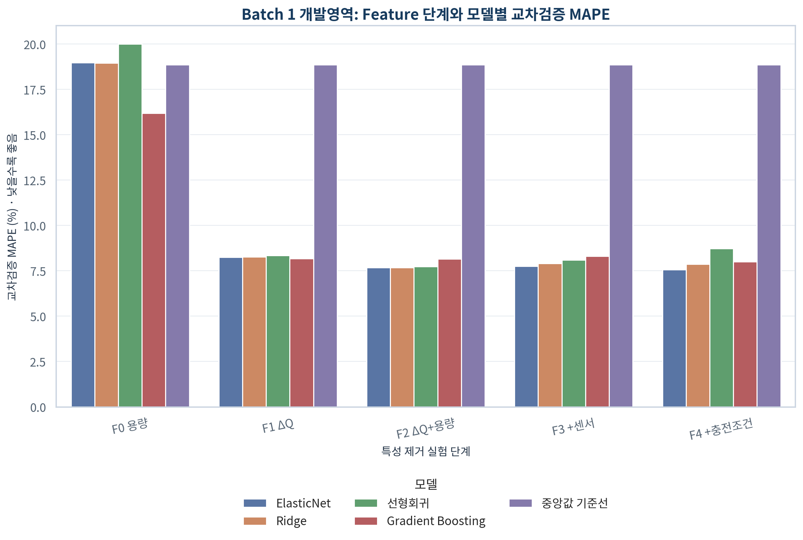
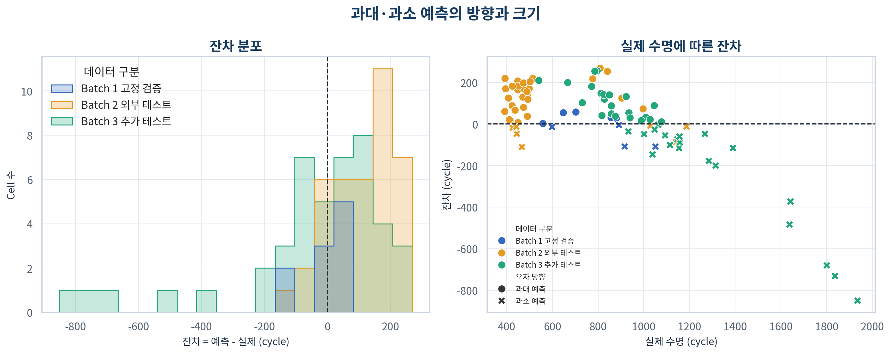
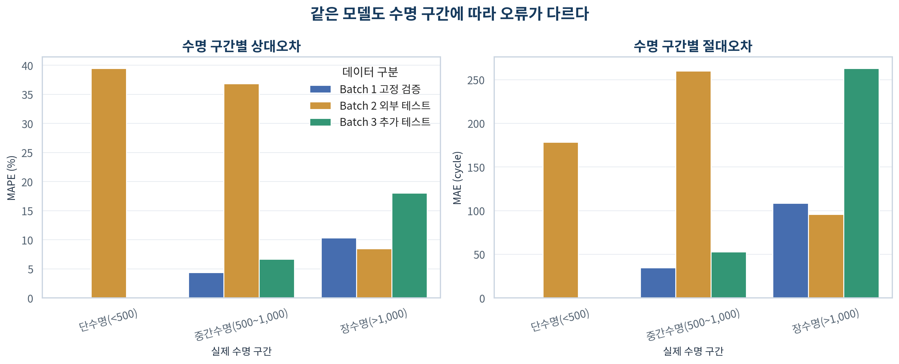
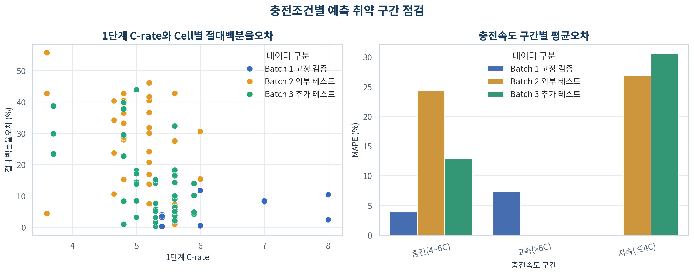
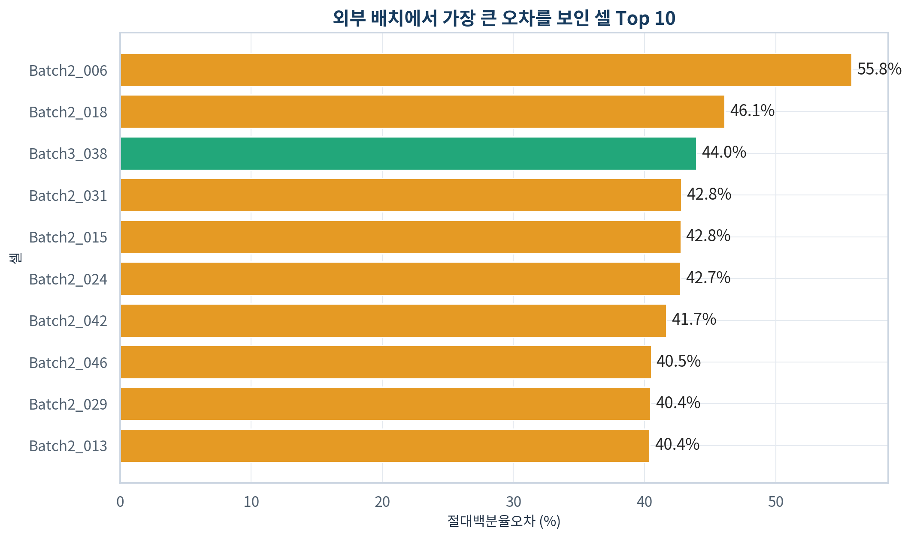
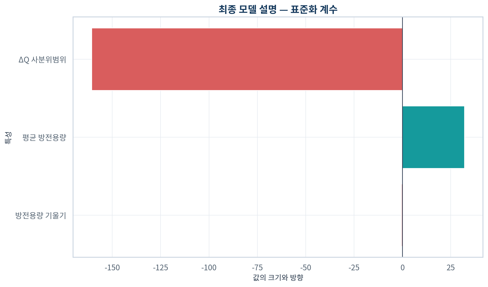
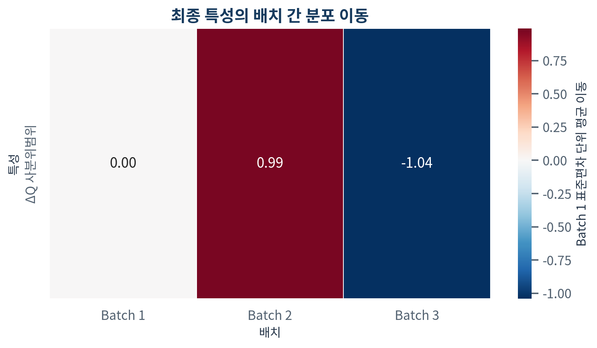

# 초기 100 Cycle 기반 배터리 수명 예측
## Day 2 — ΔQ(V) 중심 Regression 모델의 외부 Batch 일반화 검증

> **작성자:** U094 이수현  
> **작성일:** 2026-10-02 (금)  
> **주 평가지표:** MAPE (%)  
> **최종 선택:** `F2 ΔQ+Capacity` + `Ridge`

---

## 0. Executive Summary

### 한 문장 결론

Batch 1의 초기 100 cycle만으로 선택한 **Ridge** 모델은 `delta_q_iqr, qd_mean, qd_slope`를 사용했으며, Batch 1 CV MAPE **7.7%**, 고정 hold-out **5.0%**, Batch 2 외부 테스트 **36.6%**, Batch 3 추가 테스트 **12.6%**를 기록했다.

### 핵심 메시지

1. 원본 `.mat`에서 실제 cycle 번호를 사용해 Cell당 1행의 Feature를 재생성했다.
2. Day 1의 가장 강한 초기 신호인 ΔQ(V)를 Core로 구현하고, 중복 후보는 Batch 1 development CV에서만 비교했다.
3. 모든 전처리는 sklearn Pipeline 안에서 각 train fold에만 맞췄고, Batch 2는 선택 종료 후 평가했다.
4. 최종 Batch 2 성능은 원논문 참고치 9.1%보다 27.5%p 높았다. 조건이 다른 논문의 수치를 합격선으로 취급하지 않고 구현·분포 차이를 함께 분석했다.
5. Batch 3의 오차는 Batch 2보다 작았다. 이는 내부 정확도뿐 아니라 Batch별 Target·Feature shift를 관리해야 함을 보여준다.
6. ESS에서는 수명 과대 예측이 정비 지연으로 이어질 수 있으므로 평균오차 외에 오차 방향과 최악 Cell을 함께 관리해야 한다.

---

## 1. 문제와 평가 설계

목표는 배터리 Cell의 초기 100 cycle만 사용해 SOH 80% 도달 시점인 `cycle_life`를 예측하는 것이다. 모델 입력은 cycle별 행이 아니라 Cell당 1행이다.

검증은 **Batch 1 development CV → Batch 1 fixed hold-out → 설정 동결 → Batch 1 전체 재학습 → Batch 2 Test → Batch 3 추가 Test** 순서로 수행했다. Hold-out 확인 후 Feature·Hyperparameter는 바꾸지 않고 Batch 1 labeled Cell 46개 전체로 최종 모델만 다시 학습했다. Day 1에서 Batch 2·3의 분포를 이미 관찰했기 때문에 완전한 blind test는 아니지만, Day 2에서 외부 Target을 보고 Feature·모델을 다시 조정하지 않았다.

## 2. 데이터 품질과 재현 검증

| Batch | 원본 Cell | Target 가용 | cycle 10 | cycle 100 | ΔQ 가용 | 정책 파싱 | 지도학습 사용 | ΔQ 가용률(%) | Target 가용률(%) |
| --- | --- | --- | --- | --- | --- | --- | --- | --- | --- |
| Batch 1 | 46 | 46 | 46 | 46 | 46 | 46 | 46 | 100.00 | 100.00 |
| Batch 2 | 47 | 39 | 47 | 47 | 47 | 47 | 39 | 100.00 | 82.98 |
| Batch 3 | 46 | 44 | 46 | 46 | 46 | 46 | 44 | 100.00 | 95.65 |

원본에서 재계산한 핵심 Feature는 Day 1 결과와 다음과 같이 대조했다.

| 검증 Feature | 비교 Cell | 최대 절대차 | 결과 |
| --- | --- | --- | --- |
| qd_mean | 139 | <1×10⁻¹⁵ | 통과 |
| qd_slope | 139 | <1×10⁻¹⁵ | 통과 |
| ir_mean | 132 | <1×10⁻¹⁵ | 통과 |
| tavg_mean | 139 | <4×10⁻¹⁵ | 통과 |
| chargetime_mean | 139 | <2×10⁻¹⁵ | 통과 |
| delta_q_log10_var | 139 | <1×10⁻¹⁵ | 통과 |
| delta_q_iqr | 139 | <1×10⁻¹⁵ | 통과 |
| delta_q_min | 139 | <1×10⁻¹⁵ | 통과 |
| delta_q_abs_area | 139 | <1×10⁻¹⁵ | 통과 |

Target 결측 Cell은 지도학습에서 제외했지만 관측 종료 cycle로 임의 대체하지 않았다. 첫 cycle의 0값을 피하기 위해 Summary Feature는 cycle 2–100, ΔQ는 실제 cycle 10과 100을 사용했다.

## 3. ΔQ(V) Core Feature 검증

ΔQ는 다음과 같이 정의했다.

```text
ΔQ(V) = Qdlin(cycle 100, V) - Qdlin(cycle 10, V)
```

상관이 높은 ΔQ 파생값을 동시에 넣지 않고, Ridge와 동일한 반복 CV로 대표 후보를 비교했다.

| ΔQ 후보 | CV MAPE(%) | 표준편차 | SE | 선택 |
| --- | --- | --- | --- | --- |
| delta_q_iqr | 8.26 | 2.41 | 0.05 | True |
| delta_q_log10_var | 9.00 | 2.07 | 0.10 | False |
| delta_q_min | 9.06 | 2.68 | 0.07 | False |
| delta_q_abs_area | 10.34 | 3.09 | 0.11 | False |

가장 낮은 값은 `delta_q_iqr`의 8.26%였다. Day 1의 사전 1순위였던 `delta_q_log10_var`는 9.00%로 0.74%p 높았고, 최저 후보의 1-SE 경계인 8.31% 밖이었다. 따라서 외부 Batch를 보기 전에 <strong><code>delta_q_iqr</code></strong>를 Core 대표값으로 선택했다. 이것은 Day 1 결론을 뒤집은 것이 아니라, “ΔQ 정보군이 핵심이며 그 안의 중복 대표값은 Batch 1 CV로 결정한다”는 사전 규칙을 실제로 적용한 결과다.

## 4. Feature Ablation


| 단계 | Feature 수 | CV MAPE(%) | 표준편차 |
| --- | --- | --- | --- |
| F0 Capacity | 2.00 | 18.95 | 4.87 |
| F1 ΔQ | 1.00 | 8.26 | 2.41 |
| F2 ΔQ+Capacity | 3.00 | 7.68 | 2.18 |
| F3 +Sensor | 6.00 | 7.91 | 2.15 |
| F4 +Charging | 11.00 | 7.87 | 2.30 |

F0는 Capacity만, F1은 ΔQ만, F2는 ΔQ와 Capacity, F3는 Sensor, F4는 Charging까지 추가한다. 동일한 Ridge와 동일한 CV split에서 비교했으므로 단계 간 차이는 어떤 정보군이 일반화 오차를 줄였는지 보여준다.

결과는 ΔQ의 추가 가치가 매우 컸음을 보여준다. Capacity만 본 F0의 MAPE는 18.95%였지만 ΔQ 하나를 본 F1은 8.26%로 <strong>10.68%p 감소</strong>했다. F2에서 Capacity를 다시 더하면 7.68%로 0.59%p 추가 개선됐다. 반면 Sensor와 Charging을 추가한 F3·F4는 Feature가 6개와 11개로 늘었음에도 F2보다 MAPE가 각각 0.24%p, 0.19%p 높았다. 따라서 센서와 충전조건은 관찰적으로 의미가 있더라도 현재 표본에서는 안정적인 추가 예측력을 증명하지 못했다.

## 5. 모델 비교와 최종 선택



| Feature set | 모델 | Feature 수 | CV MAPE(%) | 표준편차 | 1-SE |
| --- | --- | --- | --- | --- | --- |
| F4 +Charging | ElasticNet | 11.00 | 7.56 | 2.02 | True |
| F2 ΔQ+Capacity | Ridge | 3.00 | 7.68 | 2.18 | True |
| F2 ΔQ+Capacity | ElasticNet | 3.00 | 7.68 | 2.15 | True |
| F2 ΔQ+Capacity | Linear Regression | 3.00 | 7.74 | 2.27 | False |
| F3 +Sensor | ElasticNet | 6.00 | 7.75 | 1.77 | False |
| F4 +Charging | Ridge | 11.00 | 7.87 | 2.30 | False |
| F3 +Sensor | Ridge | 6.00 | 7.91 | 2.15 | False |
| F4 +Charging | Gradient Boosting | 11.00 | 8.01 | 2.74 | False |
| F3 +Sensor | Linear Regression | 6.00 | 8.09 | 2.46 | False |
| F2 ΔQ+Capacity | Gradient Boosting | 3.00 | 8.16 | 2.71 | False |

최저 CV MAPE는 F4 ElasticNet의 7.56%였다. 그러나 F2 Ridge는 7.68%로 차이가 <strong>0.12%p</strong>뿐이어서 1-SE 범위 안에 들었다. F4 ElasticNet은 11개 Feature가 필요하지만 F2 Ridge는 3개만 사용한다. 최저 점수 한 번보다 작은 표본에서의 안정성과 설명 가능성을 우선한다는 사전 규칙에 따라 <strong>F2 ΔQ+Capacity + Ridge</strong>를 선택했고, 고정 hold-out이 안정성 기준을 통과한 뒤 설정을 동결했다.

최종 Feature는 다음과 같다.

```text
delta_q_iqr, qd_mean, qd_slope
```

## 6. 최종 성능과 Gap

| 구분 | n | MAPE(%) | CV 표준편차 | 95% CI 하한 | 95% CI 상한 | MAE | RMSE | R² | Median APE(%) |
| --- | --- | --- | --- | --- | --- | --- | --- | --- | --- |
| Train (Batch 1 CV) | 36 | 7.68 | 2.18 |  |  | 64.24 | 78.99 | 0.74 |  |
| Valid (Batch 1 Hold-out) | 10 | 4.99 |  | 2.50 | 7.67 | 41.93 | 58.38 | 0.85 | 3.66 |
| Test (Batch 2) | 39 | 36.56 |  | 30.51 | 43.01 | 188.86 | 210.93 | 0.08 | 37.09 |
| Additional Test (Batch 3) | 44 | 12.63 |  | 9.47 | 16.22 | 162.76 | 265.17 | 0.27 | 10.30 |

| Gap | 차이(%p) | 해석 |
| --- | --- | --- |
| Train-Valid | -2.69 | 양수면 내부 일반화 저하 |
| Valid-Test | 31.57 | 양수면 Batch 일반화 저하 |
| Target-Test | 27.46 | 원논문 9.1% 대비 차이 |
| Batch2-Batch3 | -23.93 | 양수면 Batch 3 성능이 더 낮음 |

- Train–Valid Gap: **-2.7%p**
- Valid–Test Gap: **31.6%p**
- Target–Test Gap: **27.5%p**
- Batch2–Batch3 Gap: **-23.9%p**


대각선에서 멀리 떨어진 Cell은 단순한 평균 성능표에서 보이지 않는 운영 위험을 보여준다. Batch 2와 Batch 3의 MAPE 차이는 Target 범위, Feature 분포와 충전정책 구성이 달라질 때 같은 모델의 성능이 변할 수 있음을 뜻한다.

Train–Valid Gap이 -2.69%p인 것은 hold-out이 CV보다 더 쉬운 표본 구성이었다는 뜻이지, 모델이 외부에서도 반드시 잘 작동한다는 뜻은 아니다. 실제로 Batch 2에서는 Valid–Test Gap이 +31.57%p까지 커졌다. 내부 검증만 보면 모델이 안정적으로 보였지만 다른 실험 Batch에 적용하자 학습 관계가 유지되지 않은 것이다. Batch 2 MAPE의 95% bootstrap 구간도 30.51–43.01%로 높아, 소수 Cell 하나가 평균을 우연히 올린 결과로 보기 어렵다.

## 7. 잔차와 실패 사례



잔차는 `예측-실제`로 정의했다. 양수는 과대 예측, 음수는 과소 예측이다.

Batch 2의 평균 실제 수명은 565.7 cycle인데 평균 예측은 741.4 cycle이었다. 평균적으로 <strong>175.7 cycle 과대 예측</strong>했으며 39개 중 35개, 즉 <strong>89.7%</strong>가 과대 예측이었다. 반대로 Batch 3은 평균 실제 수명 1,059.7 cycle을 941.7 cycle로 예측해 평균 118.0 cycle 과소 예측했고, 63.6%가 과소 예측이었다. 모델이 Batch 1의 중앙 범위 쪽으로 예측을 끌어당기면서 저수명 Batch 2는 높게, 장수명 Batch 3은 낮게 보는 회귀-평균 경향이 나타났다.



MAPE는 같은 cycle 오차라도 실제 수명이 짧은 Cell에 더 큰 비율을 부여한다. 따라서 수명 구간별 MAPE와 MAE를 함께 읽어야 한다.

Batch 2의 단수명 Cell은 28개이며 MAPE가 39.48%였다. 이 중 26개를 과대 예측했다. Batch 2 중간수명군도 MAPE 36.88%로 높았지만 장수명 3개는 8.48%였다. 즉 Batch 2의 문제는 모든 수명 구간이 동일하게 나빠진 것이 아니라, 과제에서 특히 중요한 저수명 군집을 모델이 충분히 낮게 예측하지 못한 데 집중됐다.



충전조건별 차이는 인과효과가 아니라 모델이 어떤 운전 영역에서 취약한지를 찾기 위한 진단이다.

### 외부 Batch 최악의 예측 Cell



| Cell | Batch | 실제 | 예측 | APE(%) | 방향 |
| --- | --- | --- | --- | --- | --- |
| Batch2_006 | Batch 2 | 393.00 | 667.38 | 69.82 | 과대 예측 |
| Batch2_029 | Batch 2 | 452.00 | 763.29 | 68.87 | 과대 예측 |
| Batch2_042 | Batch 2 | 474.00 | 786.50 | 65.93 | 과대 예측 |
| Batch2_031 | Batch 2 | 425.00 | 692.75 | 63.00 | 과대 예측 |
| Batch2_046 | Batch 2 | 503.00 | 801.44 | 59.33 | 과대 예측 |
| Batch2_000 | Batch 2 | 477.00 | 759.44 | 59.21 | 과대 예측 |
| Batch2_011 | Batch 2 | 449.00 | 703.32 | 56.64 | 과대 예측 |
| Batch2_010 | Batch 2 | 492.00 | 767.23 | 55.94 | 과대 예측 |
| Batch2_024 | Batch 2 | 514.00 | 799.79 | 55.60 | 과대 예측 |
| Batch2_013 | Batch 2 | 460.00 | 709.34 | 54.20 | 과대 예측 |

## 8. Feature 설명과 Batch Shift



| Feature | 값 | 종류 |
| --- | --- | --- |
| delta_q_iqr | -160.67 | 표준화 계수 |
| qd_mean | 32.03 | 표준화 계수 |
| qd_slope | -0.53 | 표준화 계수 |

계수 또는 importance는 예측 기여를 설명하지만 인과효과를 의미하지 않는다. 특히 상관된 Feature가 있으면 중요도가 서로 나뉠 수 있다.

표준화 후 `delta_q_iqr`가 1 표준편차 커지면 다른 두 Feature가 같을 때 예측 수명은 약 160.7 cycle 감소했다. `qd_mean` 1 표준편차 증가는 약 32.0 cycle 증가와 연결됐고, `qd_slope` 계수는 상대적으로 작았다. 이 계수는 Batch 1 안에서 학습된 예측 규칙이며 배터리의 물리적 인과효과로 해석해서는 안 된다.



Heatmap은 각 Batch의 Feature 평균이 Batch 1 평균에서 몇 표준편차 이동했는지 보여준다. 외부 Batch의 입력 범위가 학습 범위를 벗어나면 모델은 보간이 아니라 외삽을 하게 되며 오차가 커질 수 있다.

Batch 2의 평균 `delta_q_iqr`는 Batch 1보다 0.99 표준편차, `qd_mean`은 1.79 표준편차 높았다. 특히 Batch 2의 51.3%가 `qd_mean`의 Batch 1 관측 범위를 벗어났다. Batch 1에서 높은 초기 용량이 비교적 긴 수명과 연결됐던 규칙이, 저수명 Cell이 다수인 Batch 2에서는 그대로 유지되지 않았다. 반대로 Batch 3의 `qd_mean`은 Batch 1보다 2.23 표준편차 낮고 `delta_q_iqr`도 1.04 표준편차 낮았다. 세 Batch가 서로 다른 입력 영역을 차지한다는 사실이 외부 성능 차이의 핵심 근거다.

## 9. Day 1 전략이 실제 구현에 반영된 방식

| Day 1 결론 | Day 2 구현 | 검증 증거 |
|---|---|---|
| 초기 Capacity는 단순 기준 | F0 `qd_mean`, `qd_slope` | Ablation 표 |
| ΔQ가 가장 강하고 일관된 초기 신호 | F1 이후 `delta_q_iqr` | ΔQ 후보 CV |
| ΔQ 파생값은 중복 | 대표값 1개만 Core에 사용 | Feature 명세·선택 로그 |
| Sensor·Charging은 관계가 불안정 | F3·F4에서 단계적으로 추가 | 동일 Ridge Ablation |
| 작은 표본과 공선성 | Ridge·ElasticNet 포함 | 모델 비교표 |
| Knee는 미래정보 | 입력 Feature에서 제외 | 누수 assertion·manifest |
| Batch 분포가 다름 | Batch별 성능·shift 분리 | 성능표·shift heatmap |

## 10. ESS 운영 관점

이 모델은 초기 운전 데이터를 기반으로 Cell의 예상 수명을 선별하고, 검사·정비·교체 우선순위를 정하는 보조도구로 사용할 수 있다. 그러나 과대 예측은 실제보다 오래 사용할 수 있다고 판단하게 만들어 열화 Cell의 교체를 늦출 수 있다. 과소 예측은 조기 교체 비용을 높이지만 일반적으로 안전 측면에서는 더 보수적이다.

실제 적용에서는 다음 조건이 필요하다.

- 입력 Feature가 학습 범위 안에 있는지 확인하는 drift 경보
- 새로운 Cell 구조·충전정책·온도 범위 도입 시 재검증
- 수명 과대 예측 Cell을 별도로 감시하는 보수적 안전 마진
- Cell 결과를 module/rack으로 집계할 때 불확실성 전파
- 실제 관측 오차가 임계치를 넘으면 재학습하는 운영 규칙

## 11. 한계

1. Batch 1의 Target 가용 Cell은 46개로 작다.
2. Day 1에서 외부 Batch의 Target 분포를 이미 관찰했으므로 완전한 blind test는 아니다.
3. 원논문과 전처리·Feature·split이 같지 않아 9.1%를 직접 재현했다고 말할 수 없다.
4. 실험실 Cell 데이터는 ESS의 온도 구배, Cell 불균형과 가변 부하를 모두 대표하지 않는다.
5. 충전정책별 표본 수가 작고 Cell 구조·실험 시기와 함께 변해 인과효과를 분리하기 어렵다.
6. 초기 100 cycle이 필요하므로 신규 설비에는 cold-start 기간이 존재한다.
7. Batch shift가 크면 단일 모델의 성능이 급격히 달라질 수 있다.

## 12. 재현성과 산출물

- 전체 실행: `python src/day2_analysis.py`
- 고정 seed: `20261002`
- Feature·품질·분할: `results/day2/`
- 한국어 그래프: `figures/day2/`
- 본 보고서: `reports/DAY2_분석_보고서.md`

Batch 2 결과 이후 재튜닝하지 않았으며, 최종 모델 설정과 평가 시각을 `external_evaluation_lock.json`에 기록했다.
