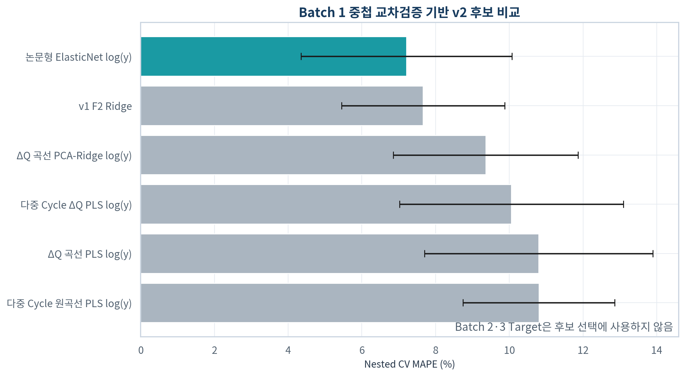
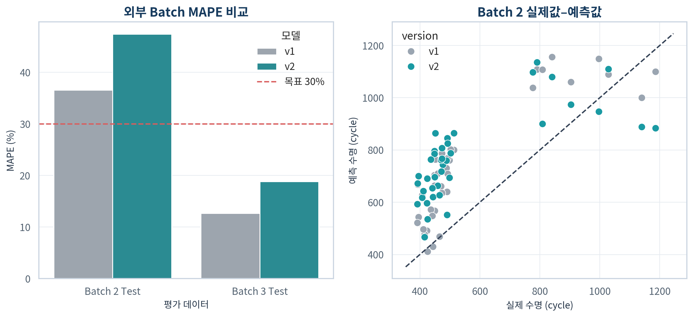
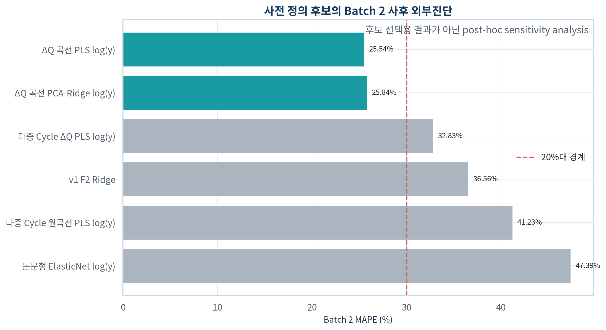

# Day 2 추가 성능 개선 실험

> 작성자: U094 이수현  
> 작성일: 2026-10-02  
> 성격: 공식 v1 외부평가 이후 수행한 post-hoc improvement study

## 1. 이 실험의 위치

공식 v1의 Feature·모델·Batch 2 MAPE 36.56%는 변경하지 않는다. 이 실험은
Batch 2에서 확인된 체계적 과대 예측을 줄일 수 있는지 검토하는 추가 연구다.
후보와 Hyperparameter는 Batch 1 development nested CV에서만 선택했지만,
실험 동기가 기존 Batch 2 결과에서 출발했으므로 v2 Batch 2 결과를 새로운
완전 blind test라고 주장하지 않는다.

## 2. 추가한 정보 표현

- 원 논문형 초기 Feature와 `log(cycle_life)` ElasticNet
- Cycle 100−10 ΔQ(V) 전체 1,000-point 곡선의 PLS/PCA 표현
- Cycle 20~100의 다중 ΔQ trajectory 통계 및 원곡선
- 모든 Imputer·Scaler·PCA·PLS는 Pipeline 안에서 fold train에만 fit

## 3. Batch 1 nested CV 후보 비교

| candidate | feature_family | feature_count | nested_cv_mape_mean | nested_cv_mape_std | worst_fold_mape | selected_v2 |
| --- | --- | --- | --- | --- | --- | --- |
| 논문형 ElasticNet log(y) | 원 논문형 Scalar | 17.00 | 7.21 | 2.86 | 14.93 | True |
| v1 F2 Ridge | 현재 Scalar 기준 | 3.00 | 7.66 | 2.21 | 10.85 | False |
| ΔQ 곡선 PCA-Ridge log(y) | ΔQ(V) 전체 곡선 | 1000.00 | 9.36 | 2.51 | 13.41 | False |
| 다중 Cycle ΔQ PLS log(y) | ΔQ trajectory | 45.00 | 10.06 | 3.04 | 16.69 | False |
| ΔQ 곡선 PLS log(y) | ΔQ(V) 전체 곡선 | 1000.00 | 10.80 | 3.10 | 16.96 | False |
| 다중 Cycle 원곡선 PLS log(y) | ΔQ trajectory 원곡선 | 9000.00 | 10.80 | 2.06 | 15.84 | False |

선택 모델은 **논문형 ElasticNet log(y)**이다. 선택 설정은 `{'regressor__model__alpha': 0.1, 'regressor__model__l1_ratio': 0.1}`이며
Batch 2·3 Target은 선택에 사용하지 않았다.

## 4. 외부 Batch 사후 비교

| version | candidate | dataset | n | mape_pct | mae | rmse | r2 | mean_bias | over_prediction_pct |
| --- | --- | --- | --- | --- | --- | --- | --- | --- | --- |
| v1 | 공식 F2 Ridge | Batch 1 Hold-out | 10.00 | 4.99 | 41.93 | 58.38 | 0.85 | -0.79 | 60.00 |
| v1 | 공식 F2 Ridge | Batch 2 Test | 39.00 | 36.56 | 188.86 | 210.93 | 0.08 | 175.69 | 89.74 |
| v1 | 공식 F2 Ridge | Batch 3 Test | 44.00 | 12.63 | 162.76 | 265.17 | 0.27 | -117.99 | 36.36 |
| v2 | 논문형 ElasticNet log(y) | Batch 1 Hold-out | 10.00 | 7.82 | 63.31 | 76.72 | 0.75 | -0.05 | 50.00 |
| v2 | 논문형 ElasticNet log(y) | Batch 2 Test | 39.00 | 47.39 | 237.22 | 255.71 | -0.36 | 206.16 | 92.31 |
| v2 | 논문형 ElasticNet log(y) | Batch 3 Test | 44.00 | 18.80 | 236.92 | 338.08 | -0.19 | -235.29 | 4.55 |

Batch 2 MAPE는 v1 **36.56%**에서 v2 **47.39%**로
10.83%p 증가했다.
20%대 목표는 **미달성**했다.

## 5. 해석 원칙

- 성능 개선 여부와 관계없이 공식 v1 결과를 대체하지 않는다.
- Batch 2를 보고 v2 Feature나 Hyperparameter를 다시 변경하지 않는다.
- 내부 CV 개선이 외부 Batch 개선으로 이어지지 않으면 Batch shift 또는
  `Feature → 수명` 관계 변화가 주된 한계라는 증거로 해석한다.
- 최종 운영에서는 평균 MAPE뿐 아니라 과대 예측률과 평균 편향을 함께 본다.

## 6. 사전 정의 후보 전체의 사후 외부진단

아래 표는 v2 후보를 다시 선택하기 위한 표가 아니다. 잠금 후보가 Batch 2에서
악화된 뒤, 사전에 코드로 정의되어 있던 표현들이 외부 Batch에서 어떻게 행동하는지
확인한 sensitivity analysis다.

| candidate | feature_family | mape_pct | mae | rmse | r2 | mean_bias | over_prediction_pct |
| --- | --- | --- | --- | --- | --- | --- | --- |
| ΔQ 곡선 PLS log(y) | ΔQ(V) 전체 곡선 | 25.54 | 131.76 | 150.67 | 0.53 | 125.12 | 94.87 |
| ΔQ 곡선 PCA-Ridge log(y) | ΔQ(V) 전체 곡선 | 25.84 | 133.00 | 151.49 | 0.52 | 126.72 | 94.87 |
| 다중 Cycle ΔQ PLS log(y) | ΔQ trajectory | 32.83 | 162.64 | 188.47 | 0.26 | 135.96 | 87.18 |
| v1 F2 Ridge | 현재 Scalar 기준 | 36.56 | 188.86 | 210.93 | 0.08 | 175.69 | 89.74 |
| 다중 Cycle 원곡선 PLS log(y) | ΔQ trajectory 원곡선 | 41.23 | 211.20 | 252.60 | -0.33 | 204.54 | 94.87 |
| 논문형 ElasticNet log(y) | 원 논문형 Scalar | 47.39 | 237.22 | 255.71 | -0.36 | 206.16 | 92.31 |

가장 낮은 Batch 2 MAPE는 **ΔQ 곡선 PLS log(y)의 25.54%**로
20%대에 도달했다. 그러나 이 후보를 Batch 2 결과를 근거로 공식 최종 모델로 승격하면
test-set selection이 된다. 따라서 이 수치는 **성능 개선 가능성의 증거**로만 보고하며,
새로운 독립 Batch에서 재검증되기 전까지 공식 v1을 대체하지 않는다.

중요한 발견은 Batch 1 내부에서 가장 좋았던 논문형 Scalar 모델보다 ΔQ 전체 곡선
모델이 Batch 2에서 훨씬 강했다는 점이다. Batch 1 내부 CV 순위와 Batch 2 순위가
다르므로, 단일 source Batch의 내부검증만으로 다른 실험 Batch의 최적 표현을 선택하기
어렵다는 한계가 확인됐다.

## 7. 재현 파일

- 코드: `src/day2_v2_improvement.py`
- 확장 Feature: `results/day2_v2/extended_feature_table.csv`
- Feature 명세: `results/day2_v2/v2_feature_manifest.csv`
- ΔQ 곡선: `results/day2_v2/delta_q_curve_data.npz`
- Nested CV: `results/day2_v2/nested_cv_comparison.csv`
- 잠금 기록: `results/day2_v2/v2_external_evaluation_lock.json`
- Cell별 예측: `results/day2_v2/v1_v2_predictions.csv`
- 사전 후보 외부진단: `results/day2_v2/predeclared_candidate_external_performance.csv`
- 의사결정 기록: `results/day2_v2/v2_decision_log.csv`
